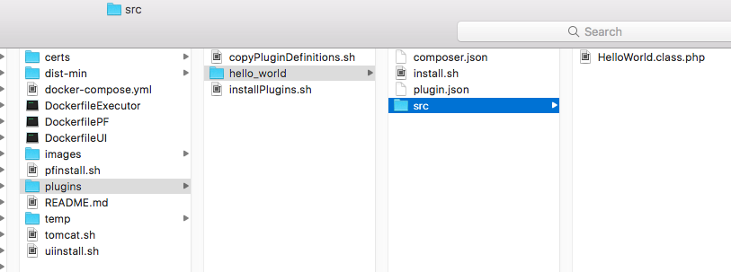
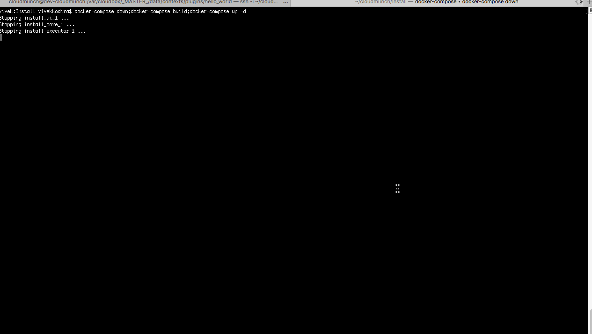

# CloudMunch Tutorial

## Introduction

This document will help you learn how to add your own custom functionality to CloudMunch through a step-by-step process. 

## Intended audience

A developer who wants to install CloudMunch locally, try it out and extend it with his own functionality

## Pre-requisites
 - Basic working knowledge of Docker

## Table of Contents
 - [Install CloudMunch Locally](#install-cloudmunch-locally)
 - [Plugins](#plugins)
 	- [hello-world-plugin](#hello-world-plugin-v1)

## Install CloudMunch Locally

## Plugins

Adding a plugin to CloudMunch is easy! All you need to do is create a bunch of files and then use docker-compose to rebuild CloudMunch services. The files you need to create are:

| File | Purpose |
|---|---|
| plugin.json | This is considered a definition of the plugin and is used by the CloudMunch UI. The file should contain information and input fields which will be used to configure the plugin before execution |
| &lt;Name&gt;.class.php | This file will contain the actual logic necessary to perform the plugin's task |
| composer.json | This file will be used to install the plugin and any of its dependencies |
| install.sh | CloudMunch uses this file to actually install your plugin. You will typically never need to edit this file |

### Hello World Plugin v1

Lets start with the simplest plugin possible: one that simply logs "Hello world" into the log and exits. Download the contents of the folder [hello-world-plugin-v1](examples/plugin_hello_world_v1) to the folder "plugins" inside the cloudmunch installation folder. The folder structure should now look like this:



Switch to the command prompt, navigate to the CloudMunch installation folder and rebuild CloudMunch services 

```bash
docker-compose down;docker-compose build;docker-compose up -d
```




