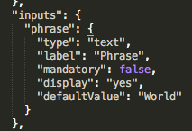
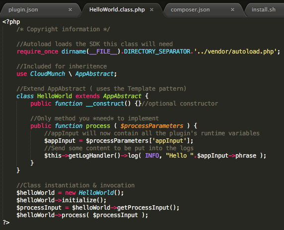

# CloudMunch Tutorial

## Introduction
This document will help you learn how to add your own custom functionality to CloudMunch through a step-by-step process. 

## Intended audience
A developer who wants to install CloudMunch locally, try it out and extend it with his own functionality

## Pre-requisites
 - Basic working knowledge of Docker

## Table of Contents
 - [Install CloudMunch Locally](#install-cloudmunch-locally)
 - [Plugins](#plugins)
 	- [Hello World Plugin v1](#hello-world-plugin-v1)

## Install CloudMunch Locally

## Plugins
Adding a plugin to CloudMunch is easy! All you need to do is create a bunch of files and then use docker-compose to rebuild CloudMunch services

### Hello World Plugin v1
Lets start with the simplest plugin possible: one that simply logs "Hello world" into the log and exits. 

- Download the contents of the folder [hello-world-plugin-v1](examples/plugin_hello_world_v1) to the folder "plugins" inside the CloudMunch installation folder. The folder structure should now look like this:


- Switch to the command prompt, navigate to the CloudMunch installation folder and rebuild CloudMunch services 

```bash
docker-compose down;docker-compose build;docker-compose up -d
```


- Once CloudMunch is up, create a new task and try to add this plugin to the task. 


**Troubleshooting** If you don't see the plugin in the list, it may be because the JSON is not well formed or because of caching. Verify the JSON and clear cache http://&lt;your_host&gt;:8000/api/reset

- Modify the step, add the phrase you want to see, run the task and check the logs. You should see the phrase you entered in the logs. 


*(Run the task with different inputs to verify that the phrase you enter is what is displayed in the logs)*

#### Plugin files
Lets understand the files necessary for a plugin. Open up the [hello-world-plugin-v1](examples/plugin_hello_world_v1/hello_world) folder. Here you will find

- plugin.json: A definition of the plugin used by our UI. This file contains information and input fields which will be used to configure the plugin before execution
- src/&lt;Name&gt;.class.php: Actual logic necessary to perform the plugin's task
- composer.json: Composer file. Used to install the plugin and any of its dependencies
- install.sh: Installs your plugin. You will typically never need to modify this file and can copy it from any other existing plugin

Lets consider each file individually and delve into a bit more detail.

##### Plugin Definition File (plugin.json)

|Definition| UI|
|---|---|
|||

The image on the left is of the plugin.json file. This file contains meta-data about the plugin you are adding and is used by us to display the plugin and when configuring it's inputs. The nodes: `_created_by`, `name`, `description`, `author`, `id`, `version` and `tags` nodes are pretty self-explanatory, so lets discuss `status`, `execute`, `inputs` & `outputs`.

- `status`: The value in this node tells us whether to pick up your plugin or not. Plugins with any status other than `enabled` are ignored and will not be available for use within the system.
- `execute`: The contents of this node tell us which language the plugin is written in and where to find the plugin's executable. The languages we support today are `PHP`, `Java` and `Ruby`
- `inputs`: The contents of this node tell us what fields a user should see and enter data for when configuring this plugin within a task. In the example, you'll notice that the input is a non-mandatory 'text' field whose label is "Phrase". 

**Optional** Change values of the nodes `mandatory (true/false)`, `display (yes/no)` and `label` to see how the display and plugin behavior is changed.

###### Input Data Types

We support all html data types. The table below demonstrates how the plugin's configuration screen changes based on the content within the `inputs` node. 

|Definition| UI|
|---|---|
|||
|||
|||
|||

The design supports more complexities such as runtime values for dropdowns or radio buttons, validations for inputs and even dependencies between inputs. These are covered elsewhere (**TBA** *add link to the section with details*) but for now, lets go on to the other files necessary to add a plugin

##### Plugin Source File



This file contains the logic necessary to execute the plugin. The logic is explained in the inline comments. We are using [PHP](https://github.com/cloudmunch/CloudMunch-php-SDK-V2/blob/master/README.md) in this example but plugins can also be written in [Ruby](https://github.com/cloudmunch/cloudmunch-Ruby-SDK/blob/master/README.md) and [Java](https://github.com/cloudmunch/CloudMunch-SDK-Java/blob/master/README.md). Do read the respective ReadMe.md files for detailed information on the syntax.


