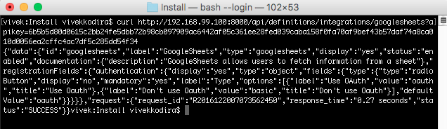

# CloudMunch Tutorial

## Introduction
This document will help you learn how to add your own custom functionality to CloudMunch through a step-by-step process. 

## Intended audience
A developer who has installed CloudMunch locally and now wants to extend it with his (or her) own functionality

## Pre-requisites
 - Basic working knowledge of Docker

## Table of Contents
 - [Aim](#our-aim)
 - [Resources](#resources)
 - [Integrations](#integrations)
 - [Interfaces](#interfaces)
 - [Plugins](#plugins)
 	- [Hello World Plugin v1](#hello-world-plugin-v1)


## Our Aim
By the end of this exercise our aim is to fetch data from a google spreadsheet and display some insight in an application. 

To achieve our aim, we'll need to configure a task to retrieve data from a

- Source
- (in a) Third-party System 
- (which we'll transform into) Insights

Or in "CloudMunch" language, we'll be configuring a `Task` which will contain a `plugin` configured to retrieve data from a

- Resource
- (in an) Integration
- (which we'll use to write into a) Report and Card

## Resources
A resource is essentially a source from which we fetch information. To add a resource into CloudMunch, we simply need to add its definition file.

### Resource Definition

```json
{
  "id": "googlesheets",
  "tags": [],
  "type": "googlesheets",
  "integration": "googlesheets",
  "label": "Google Sheets",
  "component": "Google Sheets Resource",
  "category": [ "Tutorial" ],
  "description": "Choose if you'd like insights about your Google Sheets profiles",
  "fields": {
    "name": {
      "label": "Resource Name",
      "display": "yes",
      "type": "text",
      "defaultValue": "",
      "hint": "Any name you'd like"
    },
    "sheet id": {
      "label": "Sheet ID",
      "display": "yes",
      "type": "text",
      "mandatory": true,
      "defaultValue": "",
      "hint": "Enter the sheet ID. You can copy it from the URL"
    },
    "range": {
      "label": "Range",
      "display": "yes",
      "type": "text",
      "mandatory": true,
      "defaultValue": "",
      "hint": "Enter the Range you'd like fetched (ex: 'Sheet1!A1:A5')"
    }
  }
}
```

**NOTE** Ensure the folder name and the value of the nodes `id` and `type` in the file match

The JSON file above is the definition of the integration. The fields `id`, `label`, `type` (`id`=`type`) and `description` are self-explanatory. Lets consider the others

- integration: This tells CloudMunch what integration this resource belongs to. We'll be adding the Integration itself in a bit

- component: This node is similar to `label`. When adding a resource, the end user may encounter some errors. Those errors will refer to this resource using the value in this node in their text.

- category: This node tells CloudMunch what category the resource belongs into. 

| | |
|---|---|
| Remember this screen? It is displayed when choosing resources. Note that they are organized by Categories (on the extreme left)<br/>The category you enter will mostly be one of the existing ones from this screen. <br/>If you add a new one, the resource will still be displayed, but in the new category you've entered. <br/>Remember to add at least one, resources without categories are not displayed in the UI. ||

- fields: This node tells CloudMunch what fields to display when someone is adding this resource into their application. Here, since we are adding a Google Sheets resource, we need the user to enter a name for the resource, the Sheet ID and the Range. The node follows CloudMunch's [Configuration Driven UI](#configuration-driven-ui) pattern.

Lets now add the resource to CloudMunch. 

- Download the contents of the folder [resource_googlesheets_v1](examples/resource_googlesheets_v1) to the folder "custom/resources" inside the CloudMunch installation folder.

- Switch to the command prompt, navigate to the CloudMunch installation folder and [rebuild CloudMunch](#rebuild-services)

- Once the services are up, you can verify if the resource has been added by invoking the API `/definitions/resource_types/googlesheets`.


- You should also now see the resource in the UI


A resource is only available within an integration. So before we can add this resource, we'll need an Integration. Lets add one next.

## Integrations
Integrations are essentially references to third-party systems (Ex: Google, Jira, Sonarqube). An integration instance containing your credentials can be added to an application. Later, plugins added to a task will use these credentials to fetch information from these systems.

Adding an integration into CloudMunch involves adding a single definition file. Lets add one to represent Google Sheets.

### Integration Definition

```json
{
  "id": "googlesheets",
  "label": "GoogleSheets",
  "type": "googlesheets",
  "display": "yes",
  "status": "enabled",
  "documentation": {
    "description": "GoogleSheets allows users to fetch information from a sheet"
  },
  "registrationFields": {
    "authentication": {
      "display": "yes",
      "type": "object",
      "fields": {
        "type": {
          "type": "radioButton",
          "display": "no",
          "mandatory": "yes",
          "label": "Type",
          "options": [
            {
              "label": "Use OAuth",
              "value": "oauth",
              "title": "Use Oauth"
            }
          ],
          "defaultValue": "oauth"
        }
      }
    }
  }
}
```

**NOTE** Ensure the folder name and the value of the node `id` in the file match

The JSON file above is the definition of the integration. The fields `id`, `label`, `type` (`id`=`type`), `display`, `status` and `description` are self-explanatory so lets look at `registrationFields`. 

Here, we are specifying that when adding an integration of type Google Sheets, implicitly ( notice that the value of `display` is `no` ) configure the integration to use OAuth. Why we've done this will become clear in a few moments when we actually add this integration and try to use it.

This node tells CloudMunch what fields to display when someone is adding an instance of this integration into their application. The nodes follow CloudMunch's [Configuration Driven UI](#configuration-driven-ui) pattern.

Lets now add the integration to CloudMunch. 

- Download the contents of the folder [integration_googlesheets_v1](examples/integration_googlesheets_v1) to the folder "custom/integrations" inside the CloudMunch installation folder.

- Switch to the command prompt, navigate to the CloudMunch installation folder and [rebuild CloudMunch](#rebuild-services)

- Once the services are up, you can verify if the Integration has been added by invoking the API `api/definitions/integrations/googlesheets`.



The response is a JSON and the definition you added is under the node `data`. This tells us that the Integration is now in the System.

##### Integration Logos

You can also add your own logo to an integration. Just name the file: `logo.png` and put it under `images`. When CloudMunch is rebuilt, the image will be copied as the logo of the integration.

Cool! Now we have a resource and its integration. Go to the application, click on "Add Insights", choose the resource "Google Sheets" and click "Next". There's the Integration we added. Change the name if necessary and click on "Next". 

 

We've hit a snag. This Wizard (which at the moment is the only way you can do this exercise) sees that you've configured the integration as needing OAuth. It calls the action `authorize` on the integration but this action is not defined anywhere. Lets add an interface to fix this problem.

## Interface
An interface is simply configuration that tells CloudMunch what actions are possible on an Integration. 

### Interface Definition file
As in earlier cases, it is essentially just a JSON file. Before we look at the JSON, here is some food-for-thought.

| | |
|---|---|
|<br/>[ Source: Google OAuth overview](https://developers.google.com/identity/protocols/OAuth2)| Google's OAuth is **not** a single step process. It involves multiple calls to the API where we first authenticate the client, get user authorization, get a code and then use code to get an Access Token. This Access token is what is used in subsequent requests to the API. <br/><br/>This means the interface file has to be capable of not just defining what actions are possible on an Integration but also **chaining** those actions automatically. |

### Interface Definition

The content below is the definition of the interface we'll need for integration with Google Sheets. Lets look at the nodes which probably need a bit of explanation

- configuration: This node contains details on the base url that subsequent actions will need to invoke along with the protocol, header and any IDs/secrets
- map: Think of this node as a global object available to all actions. When the action is invoked, any keys that match this map's keys will be replaced with the map's values. In this example, any parameters which expect a emailID will get the current user's user ID.
<!--- response: This node tells CloudMunch how to transform any messages sent from the third-party-system -->
- actions: This node lists all the actions possible on the interface. The key of the node is the action invoked on the integration within CloudMunch. In the values you'll see:
 - path: the actual address to add to the base_url to invoke for this action
 - method: the response sent back to the caller from the API. ( In the case of authorize, you see "REDIRECT" - which will ensure the user sees Google's account selection screen )
 - input: The params to be added to the url. These will be based on the OAuth documentation of the system you are interacting with. 
 - output: The response sent back from the third-party-system
 - condition: The conditions under which this action needs to be performed. In this example, the condition checks the integration to see if an access token is already available. If one is, the operation simply completes without accessing the third-party-system again.
 - parameters: Imagine that a action is a method you call on CloudMunch's API, these are the parameters that method expects to see. Internally, these parameters may get converted into the inputs you saw above or used internally for some processing. In the action "authorize" below, the application and integration IDs are necessary since the integration will be updated with the access token returned by Google.
 - next_action: Tells CloudMunch what to do after the response comes back. In this case, CloudMunch makes another call to Google (passing the state it got back and expecting back an access token)

GoogleSheets involves OAuth and is one of the more complex examples you'll see in CloudMunch interfaces. If your integration only specifies a username and password, the interface will be much simpler. You can explore and inspect all current interfaces with the following API

```bash
/api/interfaces/<interface id>
```
NOTE: If you don't pass the ID, you'll get back *all* the interfaces in the system.

```json
{
    "id": "googlesheets",
    "name": "googlesheets",
    "description": "Interface file for communicating with googlesheets",
    "configuration": {
        "call_type": "http",
        "base_url": "https://accounts.google.com",
        "headers": [],
        "authentication": {
            "type": "oauth",
            "client_id": "",
            "client_secret": ""
        }
    },
    "map": {
        "email": "{username}"
    },
    "response": [
        {
            "message": "",
            "condition": "==",
            "result": "",
            "error": "NO"
        }
    ],
    "actions": {
        "authorize": {
            "path": "/o/oauth2/v2/auth",
            "method": "REDIRECT",
            "input": {
                "response_type": "code",
                "client_id": "{configuration->authentication->client_id}",
                "scope": "https://www.googleapis.com/auth/spreadsheets.readonly",
                "state": "{state}",
                "access_type": "offline",
                "prompt": "select_account",
                "redirect_uri": "{callback_url}"
            },
            "output": {
                "code": "{code}"
            },
            "condition": "{configuration->authentication->access_token|null} = null",
            "parameters": {
                "callback_url": "https://dev.cloudmunch.com:543/api/",
                "state": {
                    "action": "access_token",
                    "request_id": "{request_id}",
                    "apikey": "{apikey}",
                    "url": "{url}",
                    "from": "{from}",
                    "option": "{option}",
                    "caller": "{caller)",
                    "method": "POST",
                    "domain": "{domain}",
                    "application_id": "{application_id}",
                    "integration_id": "{integration_id}",
                    "username": "{username}",
                    "referer_url": "{referer_url}"
                }
            },
            "next_action": {
                "mode": "AUTOMATIC",
                "action": "access_token"
            }
        },
        "access_token": {
            "path": "/o/oauth2/token",
            "method": "POST",
            "input": "code={code}&client_id={configuration->authentication->client_id}&client_secret={configuration->authentication->client_secret}&grant_type=authorization_code&redirect_uri={callback_url}",
            "output": {
                "access_token": "access_token",
                "expires_in": "expires_in",
                "token_type": "token_type",
                "refresh_token": "refresh_token"
            },
            "condition": "{configuration->authentication->access_token|null} = null",
            "parameters": {
                "callback_url": "{cloudmunch_api_url}",
                "state": {
                    "action": "update_integration",
                    "request_id": "{request_id}",
                    "apikey": "{apikey}",
                    "url": "{url}",
                    "from": "{from}",
                    "method": "POST",
                    "option": "{option}",
                    "caller": "{caller)",
                    "application_id": "{application_id}",
                    "integration_id": "{integration_id}",
                    "username": "{username}",
                    "domain": "{domain}",
                    "referer_url": "{referer_url}",
                    "offset": "{offset}",
                    "count": "{count}"
                },
                "code": "{code}"
            },
            "next_action": {
                "mode": "AUTOMATIC",
                "action": "update_userdata"
            }
        },
        "update_userdata": {
            "method": "PATCH",
            "context": "userdata",
            "application_id": "{application_id}",
            "integration_id": "{integration_id}",
            "condition": "{refresh_token|null} != null",
            "data": [
                {
                    "op": "add",
                    "path": "/configuration",
                    "value": {
                        "googlesheets": {
                            "refresh_token": "{refresh_token|null}"
                        }
                    }
                }
            ],
            "next_action": {
                "mode": "AUTOMATIC",
                "action": "update_integration_access_token",
                "parameters": {
                    "refresh_token": "{refresh_token|null}",
                    "access_token": "{access_token|null}"
                }
            }
        },
        "update_integration_access_token": {
            "method": "PATCH",
            "context": "integrations",
            "condition": "{access_token|null} != null",
            "application_id": "{application_id}",
            "integration_id": "{integration_id}",
            "data": [
                {
                    "op": "add",
                    "path": "/configuration",
                    "value": {
                        "authentication": {
                            "access_token": "{access_token}",
                            "authorize_time": "{$time}"
                        }
                    }
                }
            ],
            "next_action": {
                "mode": "AUTOMATIC",
                "action": "update_integration_refresh_token",
                "parameters": {
                    "refresh_token": "{$userdata/{updated_by}->configuration->googlesheets->refresh_token}",
                    "access_token": "{access_token|null}"
                }
            }
        },
        "update_integration_refresh_token": {
            "method": "PATCH",
            "context": "integrations",
            "condition": "{refresh_token|null} != null",
            "application_id": "{application_id}",
            "integration_id": "{integration_id}",
            "data": [
                {
                    "op": "add",
                    "path": "/configuration",
                    "value": {
                        "authentication": {
                            "refresh_token": "{refresh_token}"
                        }
                    }
                }
            ],
            "response": {
                "method": "REDIRECT",
                "url": "{referer_url}",
                "data": {
                    "state": {
                        "application_id": "{application_id}",
                        "integration_id": "{integration_id}",
                        "username": "{username}",
                        "domain": "{domain}",
                        "action": "list_accounts"
                    }
                }
            }
        }
    }
}
```

Lets now add the interface to CloudMunch. 

- Download the contents of the folder [interface_googlesheets_v1](examples/interface_googlesheets_v1) to the folder "custom/interfaces" inside the CloudMunch installation folder.

- Switch to the command prompt, navigate to the CloudMunch installation folder and [rebuild CloudMunch](#rebuild-services)

- Once the services are up, you can verify if the interface has been added by invoking the API `api/interfaces/googlesheets`.


## Plugins
Plugins are are CloudMunch's workhorses: how tasks get done. So it follows that a plugin is where you'll actually add code. So far adding custom content to CloudMunch has involved creating a definition JSON file and then rebuilding services. Here too, we'll follow the same pattern but in addition to specifying a definition, you'll also need to add code to actually do something.

### Hello World Plugin v1
Lets start with the simplest plugin possible: one that simply logs "Hello world" into the log and exits. 

- Download the contents of the folder [hello-world-plugin-v1](examples/plugin_hello_world_v1) to the folder "custom/plugins" inside the CloudMunch installation folder.

- Switch to the command prompt, navigate to the CloudMunch installation folder and [rebuild CloudMunch](#rebuild-services)

- Once the services are up, you can verify if the plugin has been added by invoking the API `api/plugins/hello_world`.


- Once CloudMunch is up, create a new task and try to add this plugin to the task. 


**Troubleshooting** If you don't see the plugin in the list, it may be because the JSON is not well formed or because of caching. Verify the JSON and clear cache http://&lt;your_host&gt;:8000/api/reset

- Modify the step, add the phrase you want to see, run the task and check the logs. You should see the phrase you entered in the logs. 


*(Run the task with different inputs to verify that the phrase you enter is what is displayed in the logs)*

#### Plugin files
Lets understand the files necessary for a plugin. Open up the [hello-world-plugin-v1](examples/plugin_hello_world_v1/hello_world) folder. Here you will find several files. Lets delve into a bit more detail of the file: plugin.json

##### Plugin Definition File (plugin.json)

|Definition| UI|
|---|---|
|||

This file contains meta-data about the plugin you are adding and is used by us to display the plugin and when configuring it's inputs. It is independent of the language your plugin will eventually be in. 

The nodes: `_created_by`, `name`, `description`, `author`, `id`, `version` and `tags` nodes are pretty self-explanatory aren't they? So lets discuss `status`, `execute`, `inputs` & `outputs`.

- `status`: The value in this node tells us whether to pick up your plugin or not. Plugins with any status other than `enabled` are ignored and will not be available for use within the system.
- `execute`: The contents of this node tell us which language the plugin is written in and where to find the plugin's executable. The languages we support today are `PHP`, `Java` and `Ruby`
- `inputs`: The contents of this node tell us what fields a user should see and enter data for when configuring this plugin within a task. In the example, you'll notice that the input is a non-mandatory 'text' field whose label is "Phrase". Change values of the nodes `mandatory (true/false)`, `display (yes/no)` and `label` to see how the display and plugin behavior is changed. As you've probably already discovered, this node also follows the [Configuration Driven UI](#configuration-driven-ui) pattern you are already familiar with.
- `outputs`: The contents of this node tell us what variables are put into the task after the plugin has completed execution. The values of these variables can then be used to influence subsequent steps.

Lets look at the other files necessary to add a plugin. In our example we have

- src/&lt;Name&gt;.class.php: Actual logic necessary to perform the plugin's task.
- composer.json: Composer file. Used to install the plugin and any of its dependencies
- install.sh: Installs your plugin. You will typically never need to modify this file and can copy it from any other existing plugin

These other files are necessary based on the language your plugin will be written in. We are using [PHP](https://github.com/cloudmunch/CloudMunch-php-SDK-V2/blob/master/README.md) in this example but plugins can also be written in [Ruby](https://github.com/cloudmunch/cloudmunch-Ruby-SDK/blob/master/README.md) and [Java](https://github.com/cloudmunch/CloudMunch-SDK-Java/blob/master/README.md). Do read the respective ReadMe.md files for detailed information on the syntax.

##### Plugin Logos

Did you notice that the plugin logo in the Hello World example was the CloudMunch logo? You can also add your own logo to a plugin. Just name the file: `logo.png` and put it under `images` (parallel to `src`). When CloudMunch is rebuilt, the image will be copied as the logo of the plugin.

## Configuration Driven UI

CloudMunch's UI easily supports configuring third-party tools and integrations. We do this by implementing a pattern we call "Configuration Driven UI". You, the developer of the third-party tool, tell us what we should show on screen through a simple JSON. Our framework parses the JSON and renders your configuration as HTML. The table below demonstrates how UI changes based on content in the JSON. 

|Definition| UI|
|---|---|
|||
|||
|||
|||

The design supports more complexities such as runtime values for dropdowns or radio buttons, validations for inputs and even dependencies between inputs. Navigate to `/dashboard/developer` to see actual examples of all the functionality supported.


## Rebuild Services
Several times in this tutorial you'll need to rebuild CloudMunch containers. To do this, 

| | |
|---|---|
| <ul><li>execute the command `sh customizeCloudMunch.sh` from within CloudMunch installation folder</li><li>And then reset the API's cache using the API `http://192.168.99.100:8000/api/reset` (The `apikey` param is not necessary)</li></ul> **Behind the scenes**<br/> Within the script, the following operations occur <ul><li> The script first rebuilds the 'executor' service where your plugin will be installed using docker. (The service's dockerfile contains instructions to copy custom plugins into the image and then install them using the install.sh script.)</li><li> All the definitions you've specified need to be copied to the core (the script simply copies the definitions to the shared mount) </li><li> Since the API may have cached certain responses, clearing the API cache is also necessary</li> ||


**Important**: The scripts today assume that the shared folders on the docker host are `/home/docker/platform` and that the docker host is `default`. If either of these assumptions are not true, please edit the scripts before you run them.

### Troubleshooting
#### Error: "Segmentation fault"
If the script fails with the error 'segmentation fault', please try rerunning it. I've still not figured out why it occurs but it is infrequent.

#### Error: "User cloudmunch doesn't exist"
This can occur if for some reason the user you created is no longer present on the host. Again, this occurs infrequently and the cause is not clear. Just redo the [installation steps](https://github.com/cloudmunch/Install) to do with user creation. You may also need to reapply owner permissions to the 'platform' and 'domain' folders.

## CloudMunch API
- Remember to replace the IP address with your own and to pass a valid `apikey`
- You can generate an API key from within the application