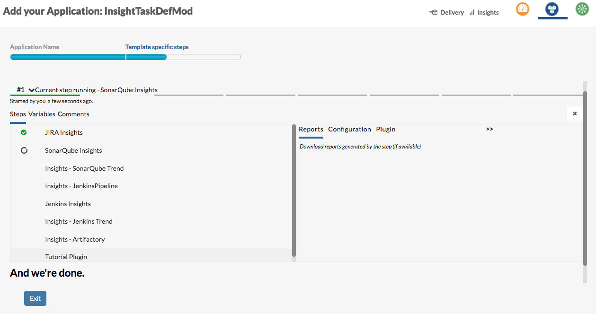

======================================
Adding your plugin to the Insight Task
======================================

An `Insight task` is automatically created at the end of the application creation wizard and user can modify, delete it and even create others from inside the application

Once you have written a plugin and tested it, you may want other users to start using it. You *could* 

- Ask them to add your plugin to their application's Insigt tasks
- Modify the `Insights Task` (created by the wizard) and add your plugin as a step
  
 However, if you would like to ensure that **any** new applications created, automatically contain your plugin, you will need to tweak the `task's` definition.

Setup
=====

- Get the existing insight task definition using the :ref:`API<taskDef>`
- Format the response
- Add your plugin as the last step in the task (by specifying an one-up order value than the largest one already present in the task )

    + The value used as key does not matter but has to be unique

.. code-block:: json

	{
        "order": 7,
        "parameters": {
        	"assigned_to": "justdave@syndicomm.com"
        },
        "name": "Tutorial Plugin",
        "plugin_id": "bugzilla",
        "plugin_name": "",
        "status": "enabled",
        "start_time": "",
        "end_time": "",
        "raise_defect_on_failure": "no",
        "abort_on_failure": "no",
        "display": "yes",
        "execute": "yes",
        "output": {},
        "retry_on_failure": "no",
        "retry_count": "1",
        "wait_time_before_retry": "1s",
        "reports": []
      }

- Now update the definition using the same API
  
.. code-block:: bash

	$ curl --data 'data={"id":"insights","run":"yes","nodesToBeReplaced":{"__REPLACE_APPLICATION_ID__":"app.id","__REPLACE_EXCEL_PATH__":"serverPath","__REPLACE_EXCEL_ASSET_ID__":"excelSource.id"},"pipeline":{"variables":{},"tiers":{},"name":"Insight Task","description":"Generates Insights for the application","category":"insights","application_id":"__REPLACE_APPLICATION_ID__","steps":{"07493318132694142":{"order":0,"parameters":{"execute":"all","resource_type":"jira","log_level":"INFO"},"name":"JIRA Insights","plugin_id":"Insights-Jira","plugin_name":"","status":"enabled","start_time":"","end_time":"","raise_defect_on_failure":"no","abort_on_failure":"no","display":"yes","execute":"yes","output":{},"retry_on_failure":"no","retry_count":"1","wait_time_before_retry":"1s","reports":[]},"03194189875083997":{"order":1,"parameters":{"execute":"all","resource_type":"sonarqube","build_number":"","log_level":"INFO"},"name":"SonarQube Insights","plugin_id":"Insights-SonarQube","plugin_name":"","status":"enabled","start_time":"","end_time":"","raise_defect_on_failure":"no","abort_on_failure":"no","display":"yes","execute":"yes","output":{},"retry_on_failure":"no","retry_count":"1","wait_time_before_retry":"1s","reports":[]},"06760063474706892":{"order":2,"parameters":{"group":"SonaQube","projection_unit":"sprint","projection_count":"7","key_metric_card_color":"#2c3e50"},"name":"Insights - SonarQube Trend","plugin_id":"Insights-SonarQubeTrend","plugin_name":"","status":"enabled","start_time":"","end_time":"","raise_defect_on_failure":"no","abort_on_failure":"no","display":"yes","execute":"yes","output":{},"retry_on_failure":"no","retry_count":"1","wait_time_before_retry":"1s","reports":[]},"07026270335520104":{"order":3,"parameters":{"execute":"all","resource_type":"artifactory"},"name":"Insights - JenkinsPipeline","plugin_id":"Insights-JenkinsPipeline","plugin_name":"","status":"enabled","start_time":"","end_time":"","raise_defect_on_failure":"no","abort_on_failure":"no","display":"yes","execute":"yes","output":{},"retry_on_failure":"no","retry_count":"1","wait_time_before_retry":"1s","reports":[]},"036806208518779293":{"order":4,"parameters":{"execute":"all","resource_type":"jenkins","log_level":"INFO"},"name":"Jenkins Insights","plugin_id":"Insights-Jenkins","plugin_name":"","status":"enabled","start_time":"","end_time":"","raise_defect_on_failure":"no","abort_on_failure":"no","display":"yes","execute":"yes","output":{},"retry_on_failure":"no","retry_count":"1","wait_time_before_retry":"1s","reports":[]},"010376157351585169":{"order":5,"parameters":{"group":"Jenkins","buildLimit":"10"},"name":"Insights - Jenkins Trend","plugin_id":"Insights-JenkinsTrend","plugin_name":"","status":"enabled","start_time":"","end_time":"","raise_defect_on_failure":"no","abort_on_failure":"no","display":"yes","execute":"yes","output":{},"retry_on_failure":"no","retry_count":"1","wait_time_before_retry":"1s","reports":[]},"047970604791053595":{"order":6,"parameters":{"execute":"all","resource_type":"artifactory"},"name":"Insights - Artifactory","plugin_id":"Insights-Artifactory","plugin_name":"","status":"enabled","start_time":"","end_time":"","raise_defect_on_failure":"no","abort_on_failure":"no","display":"yes","execute":"yes","output":{},"retry_on_failure":"no","retry_count":"1","wait_time_before_retry":"1s","reports":[]},"047970604791053666":{"order":7,"parameters":{"assigned_to":"justdave@syndicomm.com"},"name":"Tutorial Plugin","plugin_id":"bugzilla","plugin_name":"","status":"enabled","start_time":"","end_time":"","raise_defect_on_failure":"no","abort_on_failure":"no","display":"yes","execute":"yes","output":{},"retry_on_failure":"no","retry_count":"1","wait_time_before_retry":"1s","reports":[]}},"archives":{}}}' http://192.168.99.100:8000/api/definitions/insight_pipelines/insights?apikey=5a4b9ec6df1ff9c75ff84b6f848e594818621b35cdb349b13c24d8d9a456233dc466517e9228cc6f466e5ae404e8677117eff50576b4c7543c01840ca23d0893
    
- Ensure that the status in the returned response is ``SUCCESS``
  
.. code-block:: json

	{"request_id":"R2017011306214646892","response_time":"2.08 seconds","status":"SUCCESS"}

- Clear the API cache and verify that your step and plugin are present in the definition

Application
===========
- Initiate a new application creation wizard and progress to its completion
- The `Insights Task` created will contain the new step and plugin at the end

