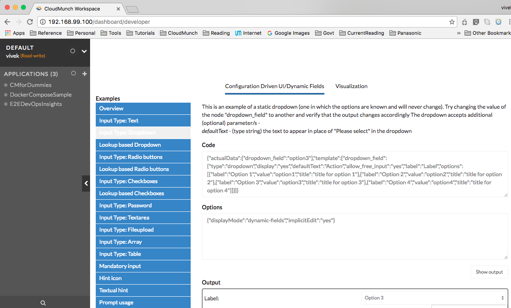
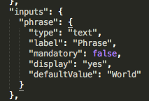
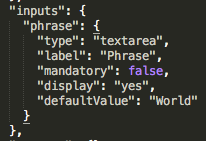
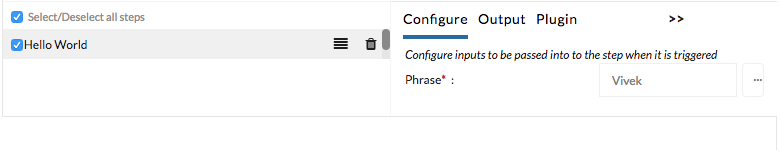
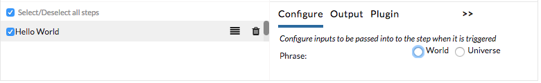

Configuration Driven UI
-----------------------

CloudMunch's UI easily supports configuring third-party tools and integrations. We do this by implementing a pattern we call "Configuration Driven UI". You, the developer of the third-party tool, tell us what we should show on screen through a simple JSON. Our framework parses the JSON and renders your configuration as HTML. The table below demonstrates how UI changes based on content in the JSON.

+----------------------+--------------------------------+ 
| Definition           | UI                             | 
+======================+================================+ 
| |text_input|   	     | |ui_configure_tab_text|        | 
+----------------------+--------------------------------+ 
| |textarea_input|     | |ui_configure_tab_textarea|    | 
+----------------------+--------------------------------+ 
| |radioButton_input|  | |ui_configure_tab_radioButton| | 
+----------------------+--------------------------------+ 
| |dropdown_input|     | |ui_configure_tab_dropdown|    | 
+----------------------+--------------------------------+ 

The design supports more complexities such as runtime values for dropdowns or radio buttons, validations for inputs and even dependencies between inputs. Navigate to ``/dashboard/developer`` to see actual examples of all the functionality supported.

.. |radioButton_input| image:: screenshots/configuration_driven_ui/radioButton_input.png
.. |dropdown_input| image:: screenshots/configuration_driven_ui/dropdown_input.png

.. |textarea_ui| image:: screenshots/configuration_driven_ui/ui_configure_tab_textarea.png

.. |ui_configure_tab_dropdown| image:: screenshots/configuration_driven_ui/ui_configure_tab_dropdown.png
