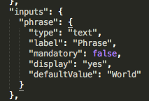
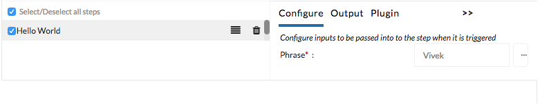
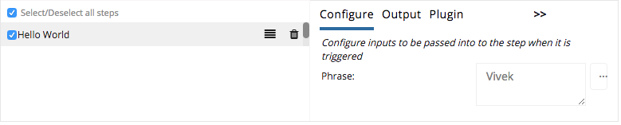
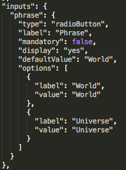
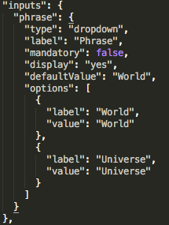
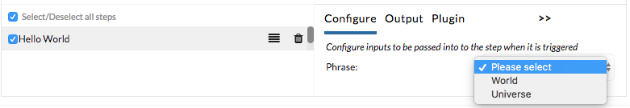
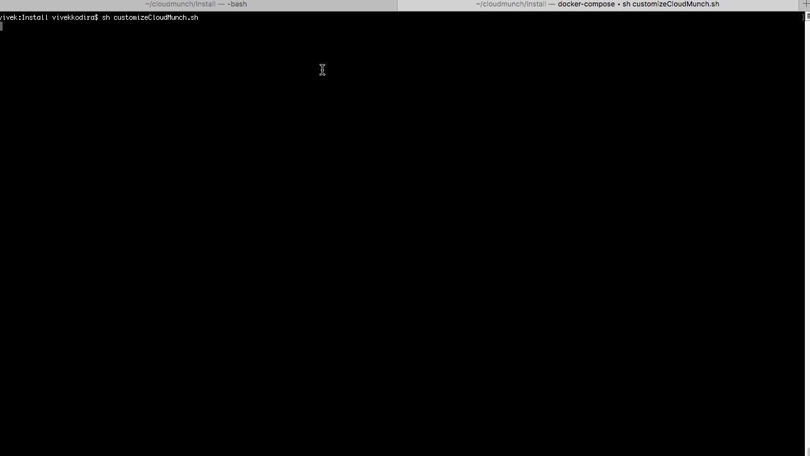

Configuration Driven UI
-----------------------

CloudMunch's UI easily supports configuring third-party tools and
integrations. We do this by implementing a pattern we call
"Configuration Driven UI". You, the developer of the third-party tool,
tell us what we should show on screen through a simple JSON. Our
framework parses the JSON and renders your configuration as HTML. The
table below demonstrates how UI changes based on content in the JSON.

+----------------------+----------------------------+
| Definition           | UI                         |
+======================+============================+
| |plugin.json file|   | |How it looks in the UI|   |
+----------------------+----------------------------+
| |plugin.json file|   | |How it looks in the UI|   |
+----------------------+----------------------------+
| |plugin.json file|   | |How it looks in the UI|   |
+----------------------+----------------------------+
| |plugin.json file|   | |How it looks in the UI|   |
+----------------------+----------------------------+

The design supports more complexities such as runtime values for
dropdowns or radio buttons, validations for inputs and even dependencies
between inputs. Navigate to ``/dashboard/developer`` to see actual
examples of all the functionality supported.

.. figure:: screenshots/cm-operations/developer-screen.png
   :alt: Developer screen

   Developer screen

.. |plugin definition file| image:: screenshots/hello-world-plugin-v1/plugin_json.png
.. |How it looks in the UI| image:: screenshots/hello-world-plugin-v1/ui_plugin_tab.png
.. |Resource category| image:: screenshots/resource_googlesheets_v1/resource_categorization.png
.. |Google OAuth 2| image:: screenshots/interface_googlesheets_v1/OAuthFlow.png

.. |plugin.json file| image:: screenshots/hello-world-plugin-v1/textarea_input.png

.. |How it looks in the UI| image:: screenshots/hello-world-plugin-v1/ui_configure_tab_radioButton.png

