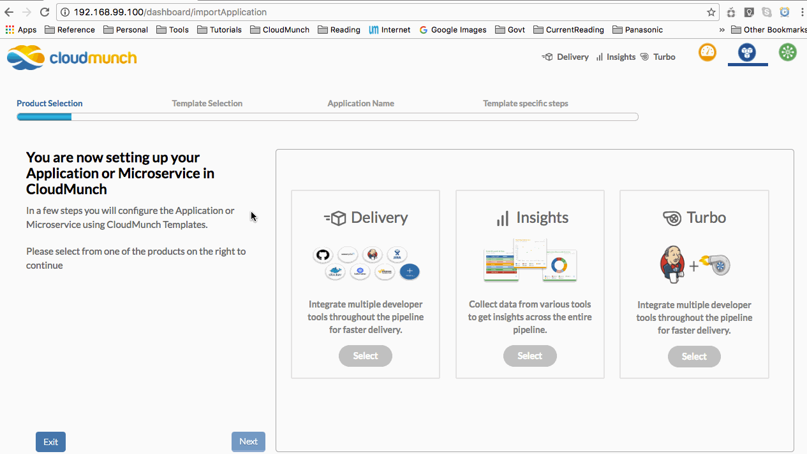

======================
Our First Application
======================

CloudMunch may already have come bundled with a sample application. However, lets create an empty one we can play around with. 

- Click on the + symbol next to the team name to begin the application creation wizard
- Abort immediately after the application has been created. 
  

   quick application creation
  
You now have a blank application to experiment with.
