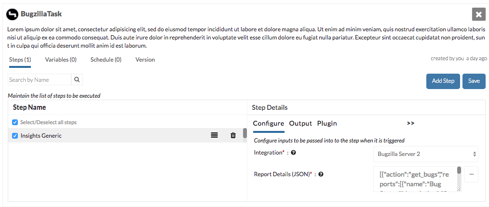
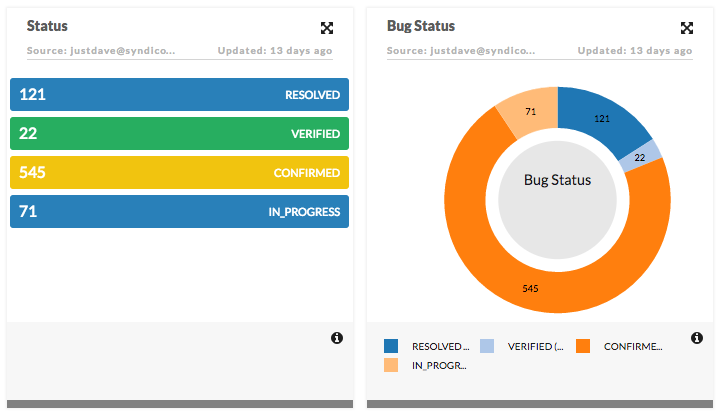

=======================
Generic Insights Plugin
=======================

If you are following the :doc:`integration<insights_integration_inputs_example>` or :doc:`interface<hardcoded_interface_example>` approaches, there is also a Generic Insights plugin that you can use instead of writing your own

Setup
=====
.. note::

    Not all the instructions below are necessary if you are progressing through each chapter sequentially. See the version numbers to decide.

**Add the Integration Definition**

-  Download the contents of the folder
   `integration_bugzilla_v1 <https://github.com/cloudmunch/cloudmunch-tutorial/tree/master/examples/integration_bugzilla_v1>`__ to the folder "custom/integrations" 

.. code-block:: bash
  
  $ cp -r ~/cloudmunch/cloudmunch-tutorial/examples/integration_bugzilla_v1/bugzilla ~/cloudmunch/Install/custom/integrations

**Add the Resource Definition**

-  Download the contents of the folder `resource_bugzilla_v1 <https://github.com/cloudmunch/cloudmunch-tutorial/tree/master/examples/resource_bugzilla_v1>`__ to the folder "custom/resources" inside the CloudMunch installation folder.

.. code-block:: bash
  
  $ cp -r ~/cloudmunch/cloudmunch-tutorial/examples/resource_bugzilla_v1/bugzilla ./custom/resources

**Add the Interface definition**

-  Download the contents of the folder
   `interface_bugzilla_v1 <https://github.com/cloudmunch/cloudmunch-tutorial/tree/master/examples/interface_bugzilla_v1>`__ to the folder "custom/interfaces" 

.. code-block:: bash
  
  $ cp -r ~/cloudmunch/cloudmunch-tutorial/examples/interface_bugzilla_v1/bugzilla ~/cloudmunch/Install/custom/interfaces

*At this point, you'd normally be adding a custom plugin but that is not necessary here*

- :doc:`rebuild_services`

Application
===========
- Create an :doc:`application<first_application>` and choose ``bugzilla`` as the resource 
- Add a new task
- Add the `Generic Insights Plugin` to the task
- In the plugin configuration screen

    + Choose the integration you just added
    + Add the following json input to the field `Report Details (JSON)`

.. code-block:: json
	
	[{"action":"get_bugs","reports":[{"name":"Bug Status","description":"Sample description","type":"doughnut","source_name":"bugs->0->assigned_to","source_url":"https://landfill.bugzilla.org/bugzilla-5.0-branch","data_path":{"path":"bugs","target":"status"},"group":"Bugzilla"},{"name":"Status","description":"Sample description","type":"kanban","source_name":"bugs->0->assigned_to","source_url":"https://landfill.bugzilla.org/bugzilla-5.0-branch","method":"COUNT","data_path":{"path":"bugs","target":"status"},"group":"Bugzilla"}]}]

- Execute the task
- Once it completes, check the dashboard. You should see the new insights cards

Behind the scenes
=================
The `Generic Insights Plugin` takes two inputs: an integration and a JSON input for `Report Details`. Lets consider the JSON input in more detail:

.. literalinclude:: ../examples/generic_insights_plugin/reportDetails.json
	:language: json

The JSON 

- is an array of actions (node: ``action``) to call on the chosen interface
- For each action

	+ one more more reports (node: ``reports``) is created with the returned response

In this example, we created 
  	
- a Doughnut titled 'Bug Status'

.. literalinclude:: ../examples/generic_insights_plugin/reportDetails.json
    :language: json
    :lines: 5-15
    :append: }
	
- a Kanban titled `Status`
  	
.. literalinclude:: ../examples/generic_insights_plugin/reportDetails.json
    :language: json
    :lines: 17-29

.. todo::

	change the input field which accepts the `integration` to resource type once it is modified in the plugin

.. todo::

	Add a link to the documentation of the generic plugin
