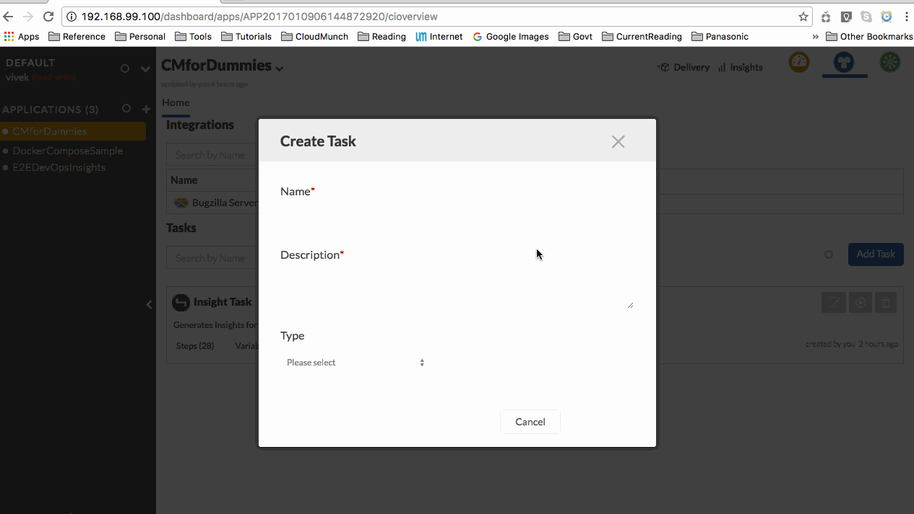
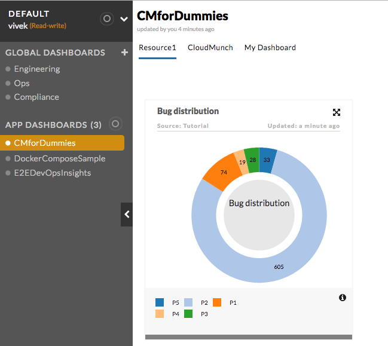

===================================================
Example: Insights with data configured in Interface
===================================================

Lets try a full-fledged example. We'll be doing the following setup

- Add a type of :doc:`Integration<integrations>`
- Add a type of :doc:`Resource<resources>`
- Add a type of :doc:`Interface<interfaces>`
- Add a type of :doc:`Plugin<plugins>`
  
Afterwards, the end user will be able to see and add the resource & integration through the wizard, configure a task to add the plugin and execute the task.

Setup
=====

**Add the Integration Definition**

-  Download the contents of the folder `integration_bugzilla_v1 <https://github.com/cloudmunch/cloudmunch-tutorial/tree/master/examples/integration_bugzilla_v1>`__
   to the folder "custom/integrations" inside the CloudMunch installation folder 

.. code-block:: bash
  
  $ cp -r ~/cloudmunch/cloudmunch-tutorial/examples/integration_bugzilla_v1/bugzilla ~/cloudmunch/Install/custom/integrations

**Add the Resource Definition**

-  Download the contents of the folder `resource_bugzilla_v1 <https://github.com/cloudmunch/cloudmunch-tutorial/tree/master/examples/resource_bugzilla_v1>`__ to the folder "custom/resources" inside the CloudMunch installation folder.

.. code-block:: bash
  
  $ cp -r ~/cloudmunch/cloudmunch-tutorial/examples/resource_bugzilla_v1/bugzilla ./custom/resources

**Add the Interface definition**

-  Download the contents of the folder
   `interface_bugzilla_v1 <https://github.com/cloudmunch/cloudmunch-tutorial/tree/master/examples/interface_bugzilla_v1>`__ to the folder "custom/interfaces" inside the CloudMunch installation folder 

.. code-block:: bash
  
  $ cp -r ~/cloudmunch/cloudmunch-tutorial/examples/interface_bugzilla_v1/bugzilla ~/cloudmunch/Install/custom/interfaces
  
**Add the Plugin definition**

-  Download the contents of the folder
   `plugin_bugzilla_v1 <https://github.com/cloudmunch/cloudmunch-tutorial/tree/master/examples/plugin_bugzilla_v1>`__ to the folder "custom/plugins" inside the CloudMunch installation folder 

.. code-block:: bash
  
  $ cp -r ~/cloudmunch/cloudmunch-tutorial/examples/plugin_bugzilla_v1/bugzilla ~/cloudmunch/Install/custom/plugins

- :doc:`rebuild_services`

Application
===========
- Create an :doc:`application<first_application>` and choose ``bugzilla`` as the resource
- Create a new task add the plugin we've just installed to the task.



   Add a task and plugin

- Trigger the task and once it completes, check the insights for the resource. You should now see a card similar to the image below:



   Insight card

Behind the scenes
=================
The work is done by `Bugzilla.class.php <https://github.com/cloudmunch/cloudmunch-tutorial/tree/master/examples/plugin_bugzilla_v1/bugzilla/src/Bugzilla.class.php>`__ . The ``process``` method is performing the following steps:

- Get all resources of a particular type 
- For each resource
    
    + Fetch information from it's integration
    + Transform and store information as :doc:`insights <insights>` cards

Here is the code

.. literalinclude:: ../examples/plugin_bugzilla_v1/bugzilla/src/Bugzilla.class.php
   :language: php
   :start-after: Only method you *need* to implement
   :end-before: End of process method
   :prepend: <?php
   :append: ?>
   :dedent: 4

There are three helpers used in the code. 

- ``$this->getCloudmunchInsightHelper()`` - This helper is written specifically for insights and contains several utility methods to fetch resources and write cards and keymetric data
- ``$this->getCloudmunchService();`` - This helper is used to make calls to CloudMunch's API
- ``$this->getLogHandler()`` - This helper is used to log ``INFO`` and ``ERRROR`` messages

For more information on these and the other utilities available, please refer to the :ref:`refSDKs`

But the end user didn't enter any information in this example at all. How did it know what user to fetch the information for? 

.. note:: 

   Did you notice that the fields ``bugzilla_url`` and ``assigned_to`` were necessary for the action ``get_bugs``. Do you see the two fields in squiggly brackets used in the ``method`` node of the interface? When the interface method ``get_bugs`` is invoked, CloudMunch replaces the stuff in squiggly brackets ``{}`` with the values in the node ``map``

.. literalinclude:: ../examples/interface_bugzilla_v1/bugzilla/definition.json
   :language: json
   :emphasize-lines: 6-7,11-12

.. warning::

    Adding credential information directly is discouraged. Since interface definitions stored in plain text and are available through the API, any user will be able to read them. If storing credentials for use in an interface, store them in the :doc:`integration<insights_integration_inputs_example>`

.. todo::
   Remove the dummy field in the integration after the bug (which causes integrations without registrationFields to not be added) is resolved

.. todo::
   Remove the dummy field in the plugin examples after the bug (which causes plugins without fields to not get executed) is resolved