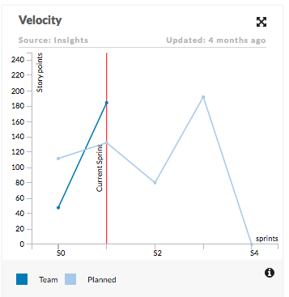
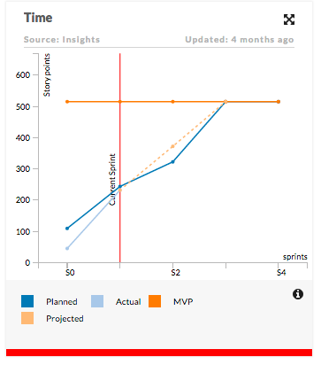
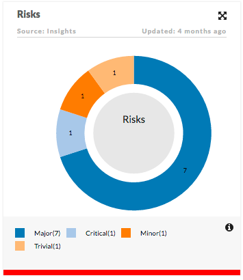
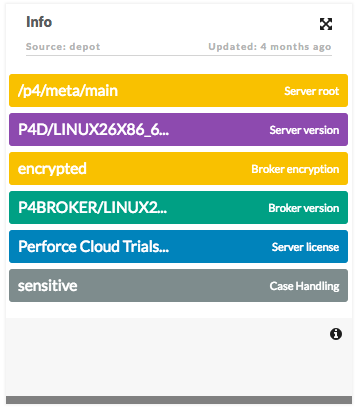
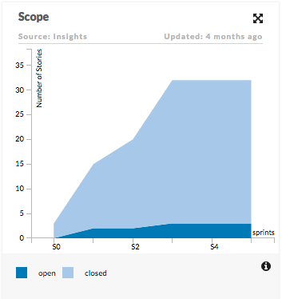
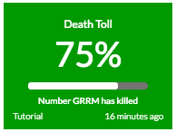

========
Insights
========

Insights in CloudMunch are categorized as "Cards" & "Key metrics". Both are visual representations of data but differ in intent and visibility. In both cases, the data is stored as JSON ( by a plugin ) in CloudMunch.

Card
----

A card is typically displayed under some category. Today, we support the following types of cards:

- Trend
- Doughnut
- Kanban
- Area Graph

Trend
~~~~~

Example 1
^^^^^^^^^
The JSON

.. literalinclude:: screenshots/insights/trend1.json
	:language: json

produces

Example 2
^^^^^^^^^
The JSON

.. literalinclude:: screenshots/insights/trend2.json
	:language: json

produces

Doughnut
~~~~~~~~

The JSON

.. literalinclude:: screenshots/insights/doughnut1.json
	:language: json

produces

Kanban
~~~~~~

The JSON

.. literalinclude:: screenshots/insights/kanban1.json
	:language: json

produces

Area Graph
~~~~~~~~~~

The JSON

.. literalinclude:: screenshots/insights/area1.json
	:language: json

produces

Key Metric
----------

Key Metrics are displayed at the top level and are intended to serve as a summary or to highlight important information to users.

  
    An example of a Key metric

A keymetric always has

- A title ( "Death Toll" )
- A percentage value ( "75%" )
- A caption for the value ( "Number GRRM has killed" )
- A link ( & corresponding title ) to the source of the data ( "Tutorial" )

.. todo::
	Add description for all the nodes in the insight cards