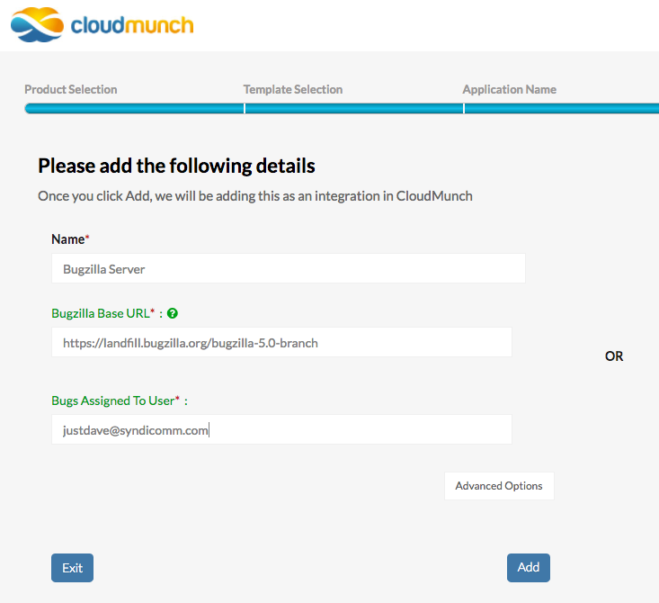

================================================
Example: Insights with Integration driven inputs
================================================

In this approach, the end user can enter the fields necessary for the interface call when configuring the `integration` in the wizard

    Integration screen

Choose this approach if the information needed to make the interface call should be visible to & editable by the end-user but when it does not change very often or when the information is any kind of credentials.

Setup
=====
.. note::

    Not all the instructions below are necessary if you are progressing through each chapter sequentially. See the version numbers to decide.

**Add the Integration Definition**

-  Download the contents of the folder
   `integration_bugzilla_v2 <https://github.com/cloudmunch/cloudmunch-tutorial/tree/master/examples/integration_bugzilla_v2>`__ to the folder "custom/integrations" 

.. code-block:: bash
  
  $ cp -r ~/cloudmunch/cloudmunch-tutorial/examples/integration_bugzilla_v2/bugzilla ~/cloudmunch/Install/custom/integrations

**Add the Resource Definition**

-  Download the contents of the folder `resource_bugzilla_v1 <https://github.com/cloudmunch/cloudmunch-tutorial/tree/master/examples/resource_bugzilla_v1>`__ to the folder "custom/resources" inside the CloudMunch installation folder.

.. code-block:: bash
  
  $ cp -r ~/cloudmunch/cloudmunch-tutorial/examples/resource_bugzilla_v1/bugzilla ~/cloudmunch/Install/custom/resources

**Add the Interface definition**

-  Download the contents of the folder
   `interface_bugzilla_v2 <https://github.com/cloudmunch/cloudmunch-tutorial/tree/master/examples/interface_bugzilla_v2>`__ to the folder "custom/interfaces" 

.. code-block:: bash
  
  $ cp -r ~/cloudmunch/cloudmunch-tutorial/examples/interface_bugzilla_v2/bugzilla ~/cloudmunch/Install/custom/interfaces

**Add the Plugin definition**

-  Download the contents of the folder
   `plugin_bugzilla_v1 <https://github.com/cloudmunch/cloudmunch-tutorial/tree/master/examples/plugin_bugzilla_v1>`__ to the folder "custom/plugins" inside the CloudMunch installation folder 

.. code-block:: bash
  
  $ cp -r ~/cloudmunch/cloudmunch-tutorial/examples/plugin_bugzilla_v1/bugzilla ~/cloudmunch/Install/custom/plugins

- :doc:`rebuild_services`

Application
===========
- Create an :doc:`application<first_application>` and choose ``bugzilla`` as the resource 
- You'll be prompted to create an integration and see the fields you just specified. 
- Add the same values we'd seen in the interface earlier (see below) and click "Next". 

.. literalinclude:: ../examples/interface_bugzilla_v1/bugzilla/definition.json
   :start-after: "Interface file for communicating with bugzilla"
   :end-before: "actions"

- Add a new task
- Add the Bugzilla plugin to the task
- Execute the task
- Once it completes, check the dashboard. You should see the following cards and key metrics:

.. figure:: screenshots/plugin_bugzilla_v1/insights.png
   :alt: Insight card
   :align: center

   Insight card

Behind the scenes
=================

**Interface**

The node ``map`` is removed from the `interface <https://github.com/cloudmunch/cloudmunch-tutorial/tree/master/examples/interface_bugzilla_v2/bugzilla/definition.json>`__

.. literalinclude:: ../examples/interface_bugzilla_v2/bugzilla/definition.json
   :language: json

.. literalinclude:: ../examples/interface_bugzilla_v2/bugzilla/definition.json
   :diff: ../examples/interface_bugzilla_v1/bugzilla/definition.json

**Integration**

The `integration <https://github.com/cloudmunch/cloudmunch-tutorial/tree/master/examples/integration_bugzilla_v2/bugzilla/definition.json>`__ now contains ``registrationFields``

.. literalinclude:: ../examples/integration_bugzilla_v2/bugzilla/definition.json
   :start-after: "events": []
   :end-before: "importFields": {}