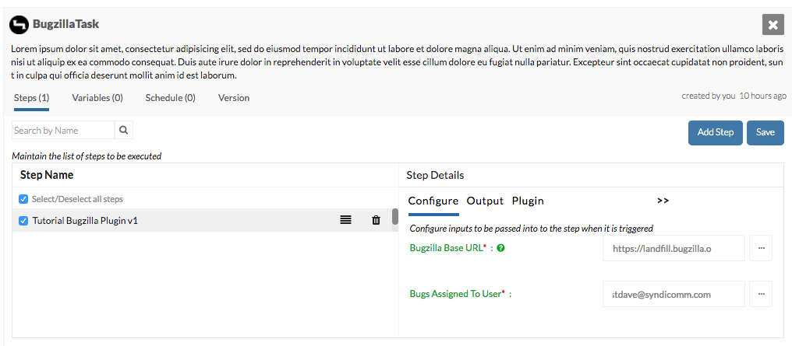
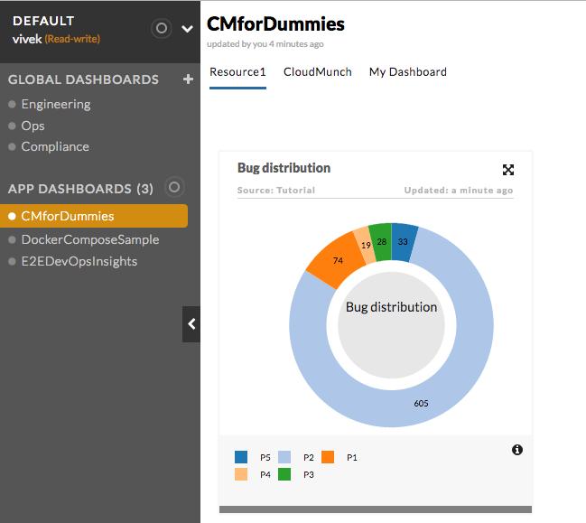

==============================================
Example: Insights with Plugin driven inputs
==============================================

In this approach, the end user would enter the fields necessary for the `interfaces` call when configuring the `plugin`

    Plugin screen

Choose this approach if the information needed to make the `interface` call is ( or should only be) known to the user who will be configuring the `plugin`. 

.. warning::
    While it is possible to store credentials within plugins, please avoid doing so. The correct place to store credentials will be the `integration`.

Setup
=====
.. note::

    Not all the instructions below are necessary if you are progressing through each chapter sequentially. See the version numbers to decide.

**Add the Integration Definition**

-  Download the contents of the folder
   `integration_bugzilla_v1 <https://github.com/cloudmunch/cloudmunch-tutorial/tree/master/examples/integration_bugzilla_v1>`__ to the folder "custom/integrations" 

.. code-block:: bash
  
  $ cp -r ~/cloudmunch/cloudmunch-tutorial/examples/integration_bugzilla_v1/bugzilla ~/cloudmunch/Install/custom/integrations

**Add the Interface Definition**

-  Download the contents of the folder
   `interface_bugzilla_v3 <https://github.com/cloudmunch/cloudmunch-tutorial/tree/master/examples/interface_bugzilla_v3>`__ to the folder "custom/integrations" 

.. code-block:: bash
  
  $ cp -r ~/cloudmunch/cloudmunch-tutorial/examples/interface_bugzilla_v3/bugzilla ~/cloudmunch/Install/custom/interfaces

**Add the Resource Definition**

-  Download the contents of the folder `resource_bugzilla_v1 <https://github.com/cloudmunch/cloudmunch-tutorial/tree/master/examples/resource_bugzilla_v1>`__ to the folder "custom/resources" inside the CloudMunch installation folder.

.. code-block:: bash
  
  $ cp -r ~/cloudmunch/cloudmunch-tutorial/examples/resource_bugzilla_v1/bugzilla ./custom/resources

**Add the Plugin definition**

-  Download the contents of the folder
   `plugin_bugzilla_v2 <https://github.com/cloudmunch/cloudmunch-tutorial/tree/master/examples/plugin_bugzilla_v2>`__ to the folder "custom/plugin" 

.. code-block:: bash
  
  $ cp -r ~/cloudmunch/cloudmunch-tutorial/examples/plugin_bugzilla_v2/bugzilla ~/cloudmunch/Install/custom/plugins

- :doc:`rebuild_services`

Application
===========
- Create an :doc:`application<first_application>` and choose ``bugzilla`` as the resource 
- Add the integration, resource & exit the wizard
- Add a new task. 
- Add the plugin - You'll now see fields in the ``plugin`` configuration. Enter appropriate values.
- execute the task 
- Once it completes, check the dashboard. You should see the following cards and key metrics:

   Insight card

Behind the scenes
=================

**Interface**

The ``map`` node in the `interface <https://github.com/cloudmunch/cloudmunch-tutorial/tree/master/examples/interface_bugzilla_v3/bugzilla/definition.json>`__ now contains only one field. 

.. literalinclude:: ../examples/interface_bugzilla_v3/bugzilla/definition.json
   :language: json

.. literalinclude:: ../examples/interface_bugzilla_v3/bugzilla/definition.json
   :diff: ../examples/interface_bugzilla_v1/bugzilla/definition.json

There is however a new node within the ``action`` called ``input``

.. literalinclude:: ../examples/interface_bugzilla_v3/bugzilla/definition.json
   :start-after: "path"
   :end-before: "method"

.. warning::
  Values passed from the plugin will only be replaced when they are within the ``data`` of a request to the external system. This example would **NOT** have worked if we had tried to pass the ``bugzilla_url`` from the plugin. This is intentionally restricted in the system for security reasons. Use the integration approach for such fields

*Integration**

Some fields were removed from ``registrationFields`` in the `integration <https://github.com/cloudmunch/cloudmunch-tutorial/tree/master/examples/integration_bugzilla_v2/bugzilla/definition.json>`__

.. literalinclude:: ../examples/integration_bugzilla_v1/bugzilla/definition.json
   :start-after: "events": []
   :end-before: "importFields": {}

.. literalinclude:: ../examples/integration_bugzilla_v1/bugzilla/definition.json
   :diff: ../examples/integration_bugzilla_v2/bugzilla/definition.json

**Plugin**

A new node ``inputs`` is added to the `plugin <https://github.com/cloudmunch/cloudmunch-tutorial/tree/master/examples/plugin_bugzilla_v2/bugzilla/plugin.json>`__

.. literalinclude:: ../examples/plugin_bugzilla_v2/bugzilla/plugin.json
   :start-after: "inputs": {
   :end-before: "outputs": {}
   :prepend: "inputs": {

In the `plugin` `source code <https://github.com/cloudmunch/cloudmunch-tutorial/tree/master/examples/plugin_bugzilla_v2/bugzilla/src/Bugzilla.class.php>`__ the inputs to the `plugin` are passed through to CloudMunch API

.. literalinclude:: ../examples/plugin_bugzilla_v2/bugzilla/src/Bugzilla.class.php
   :diff: ../examples/plugin_bugzilla_v1/bugzilla/src/Bugzilla.class.php