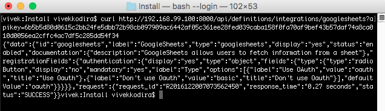
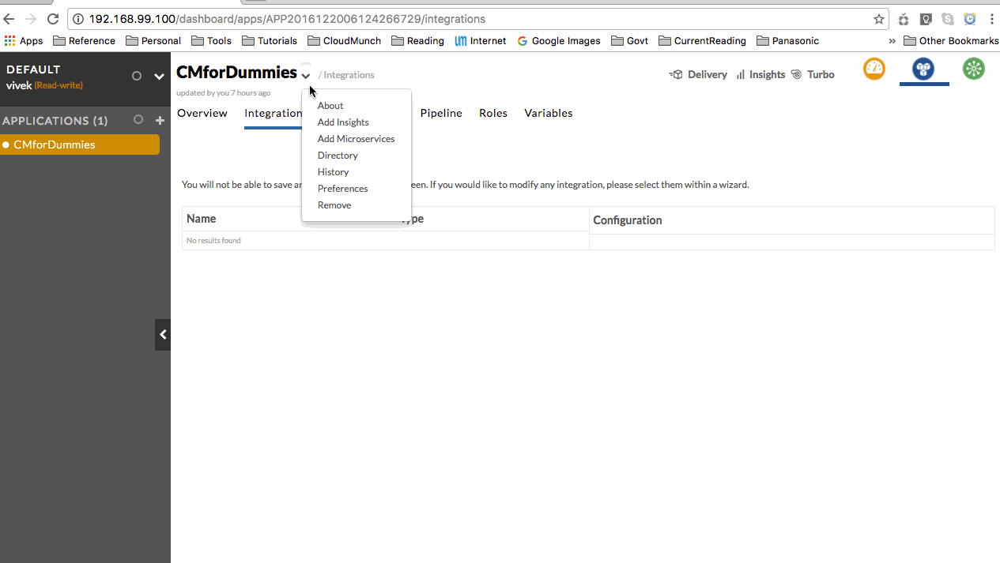

Integrations
------------

Integrations are essentially references to third-party systems (Ex:
Google, Jira, Sonarqube). An integration instance containing your
credentials can be added to an application. Later, plugins added to a
task will use these credentials to fetch information from these systems.

Adding an integration into CloudMunch involves adding a single
definition file. Lets add one to represent Google Sheets.

Integration Definition
~~~~~~~~~~~~~~~~~~~~~~

.. code:: json

    {
      "id": "googlesheets",
      "label": "GoogleSheets",
      "type": "googlesheets",
      "display": "yes",
      "status": "enabled",
      "documentation": {
        "description": "GoogleSheets allows users to fetch information from a sheet"
      },
      "registrationFields": {
        "authentication": {
          "display": "yes",
          "type": "object",
          "fields": {
            "type": {
              "type": "radioButton",
              "display": "no",
              "mandatory": "yes",
              "label": "Type",
              "options": [
                {
                  "label": "Use OAuth",
                  "value": "oauth",
                  "title": "Use Oauth"
                }
              ],
              "defaultValue": "oauth"
            }
          }
        }
      }
    }

**NOTE** Ensure the folder name and the value of the node ``id`` in the
file match

The JSON file above is the definition of the integration. The fields
``id``, ``label``, ``type`` (``id``\ =\ ``type``), ``display``,
``status`` and ``description`` are self-explanatory so lets look at
``registrationFields``.

Here, we are specifying that when adding an integration of type Google
Sheets, implicitly ( notice that the value of ``display`` is ``no`` )
configure the integration to use OAuth. Why we've done this will become
clear in a few moments when we actually add this integration and try to
use it.

This node tells CloudMunch what fields to display when someone is adding
an instance of this integration into their application. The nodes follow
CloudMunch's :doc:`configuration_driven_ui`
pattern.

Lets now add the integration to CloudMunch.

-  Download the contents of the folder
   `integration\_googlesheets\_v1 <https://github.com/cloudmunch/cloudmunch-tutorial/tree/master/examples/integration_googlesheets_v1>`__
   to the folder "custom/integrations" inside the CloudMunch
   installation folder.

-  Switch to the command prompt, navigate to the CloudMunch installation
   folder and :doc:`rebuild_services`

-  Once the services are up, you can verify if the Integration has been
   added by invoking the API
   ``api/definitions/integrations/googlesheets``.

   curl verification

The response is a JSON and the definition you added is under the node
``data``. This tells us that the Integration is now in the System.

Integration Logos
'''''''''''''''''

You can also add your own logo to an integration. Just name the file:
``logo.png`` and put it under ``images``. When CloudMunch is rebuilt,
the image will be copied as the logo of the integration.

Cool! Now we have a resource and its integration. Go to the application,
click on "Add Insights", choose the resource "Google Sheets" and click
"Next". There's the Integration we added. Change the name if necessary
and click on "Next".

   Oauth issue

We've hit a snag. This Wizard (which at the moment is the only way you
can do this exercise) sees that you've configured the integration as
needing OAuth. It calls the action ``authorize`` on the integration but
this action is not defined anywhere. Lets add an interface to fix this
problem.