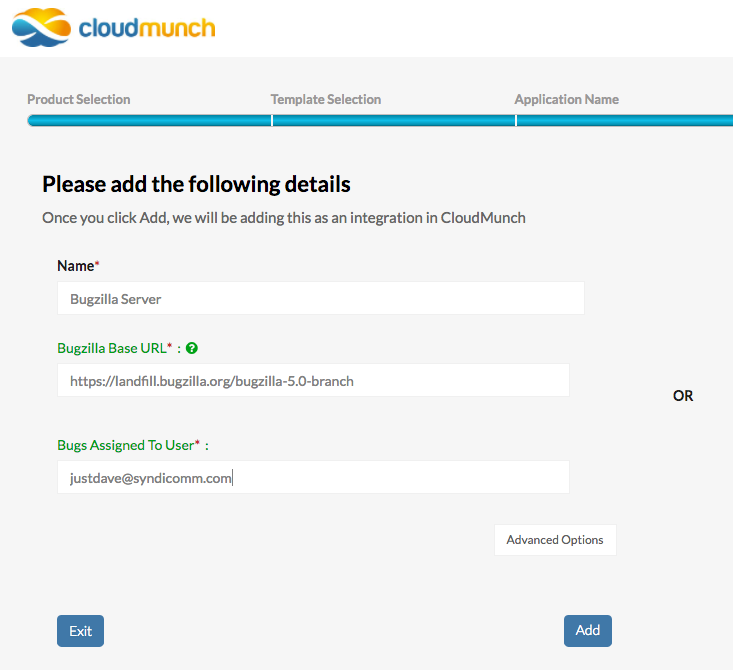

=============
Integrations
=============

Integrations are references to third-party systems (Ex: Google, Jira, Sonarqube). Adding a new type of integration into CloudMunch involves adding a single definition file.

Sample Integration Definition
~~~~~~~~~~~~~~~~~~~~~~~~~~~~~
.. literalinclude:: ../examples/integration_bugzilla_v2/bugzilla/definition.json
   :language: json

The JSON file above is the definition of a sample integration we will use in this tutorial. The fields ``id``, ``label``, ``type`` (``id``\ =\ ``type``), ``display``, ``status`` and ``description`` are self-explanatory so lets look at ``registrationFields``.

registrationFields
^^^^^^^^^^^^^^^^^^
When an end user attempts to add an integration of this type, CloudMunch will ask for the information specified in this node. The node follows CloudMunch's :doc:`Configuration Driven UI<configuration_driven_ui>` pattern.

.. literalinclude:: ../examples/integration_bugzilla_v2/bugzilla/definition.json
   :start-after: "registrationFields": {
   :prepend: "registrationFields": {

    Integration screen
 
authentication
^^^^^^^^^^^^^^
You can add (node: ``authentication``) under (node: ``registrationFields``), to specify the fields used to authenticate the user.
For example,

.. code-block:: json

   {
    "registrationFields": {
      "appurl": {
       "type": "text",
       "display": "yes",
       "label": "Application URL",
       "mandatory": true,
       "hint": "Application URL",
       "validation_rules": []
       },
      "authentication": {
       "display": "yes",
       "type": "object",
       "fields": {
        "username": {
          "type": "text",
          "display": "yes",
          "label": "User name",
          "mandatory": true,
          "hint": "User name"
         },
        "password": {
          "type": "password",
          "display": "yes",
          "label": "Password",
          "hint": "Enter user password"
         }
        }
       }
      }
     }

    

Integration Logos
~~~~~~~~~~~~~~~~~
You can also add your own logo to an integration. Just name the file: ``logo.png`` and put it under a sub-folder ``images``. When CloudMunch is :doc:`rebuilt<rebuild_services>`, the image you added will be displayed as the logo of the integration.

.. note::

  You can explore and inspect all integration definitions with the API `/api/definitions/integrations/<integration id>`. If you don't pass the ID, you'll get back definitions for *all* the integration types in the system