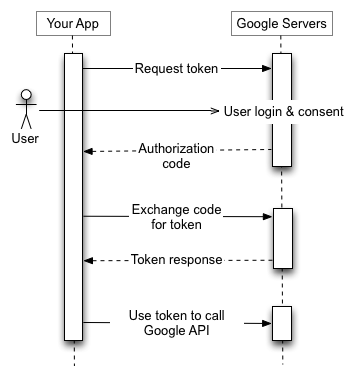

Interface
---------

An interface is simply configuration that tells CloudMunch what actions are possible on an Integration.

Interface Definition file
~~~~~~~~~~~~~~~~~~~~~~~~~

As in earlier cases, it is essentially just a JSON file. Before we look at the JSON, here is some food-for-thought.

    
    Google's OAuth is not a single step process. It involves multiple calls to the API where we first authenticate the client, get user authorization, get a code and then use code to get an Access Token. This Access token is what is used in subsequent requests to the API. This means the interface file has to be capable of not just defining what actions are possible on an Integration but also chaining those actions automatically.

Interface Definition
~~~~~~~~~~~~~~~~~~~~

The content below is the definition of the interface we'll need for integration with Google Sheets. 

.. code:: json

    {
        "id": "googlesheets",
        "name": "googlesheets",
        "description": "Interface file for communicating with googlesheets",
        "configuration": {
            "call_type": "http",
            "base_url": "https://accounts.google.com",
            "headers": [],
            "authentication": {
                "type": "oauth",
                "client_id": "",
                "client_secret": ""
            }
        },
        "map": {
            "email": "{username}"
        },
        "response": [
            {
                "message": "",
                "condition": "==",
                "result": "",
                "error": "NO"
            }
        ],
        "actions": {
            "authorize": {
                "path": "/o/oauth2/v2/auth",
                "method": "REDIRECT",
                "input": {
                    "response_type": "code",
                    "client_id": "{configuration->authentication->client_id}",
                    "scope": "https://www.googleapis.com/auth/spreadsheets.readonly",
                    "state": "{state}",
                    "access_type": "offline",
                    "prompt": "select_account",
                    "redirect_uri": "{callback_url}"
                },
                "output": {
                    "code": "{code}"
                },
                "condition": "{configuration->authentication->access_token|null} = null",
                "parameters": {
                    "callback_url": "https://dev.cloudmunch.com:543/api/",
                    "state": {
                        "action": "access_token",
                        "request_id": "{request_id}",
                        "apikey": "{apikey}",
                        "url": "{url}",
                        "from": "{from}",
                        "option": "{option}",
                        "caller": "{caller)",
                        "method": "POST",
                        "domain": "{domain}",
                        "application_id": "{application_id}",
                        "integration_id": "{integration_id}",
                        "username": "{username}",
                        "referer_url": "{referer_url}"
                    }
                },
                "next_action": {
                    "mode": "AUTOMATIC",
                    "action": "access_token"
                }
            },
            "access_token": {
                "path": "/o/oauth2/token",
                "method": "POST",
                "input": "code={code}&client_id={configuration->authentication->client_id}&client_secret={configuration->authentication->client_secret}&grant_type=authorization_code&redirect_uri={callback_url}",
                "output": {
                    "access_token": "access_token",
                    "expires_in": "expires_in",
                    "token_type": "token_type",
                    "refresh_token": "refresh_token"
                },
                "condition": "{configuration->authentication->access_token|null} = null",
                "parameters": {
                    "callback_url": "{cloudmunch_api_url}",
                    "state": {
                        "action": "update_integration",
                        "request_id": "{request_id}",
                        "apikey": "{apikey}",
                        "url": "{url}",
                        "from": "{from}",
                        "method": "POST",
                        "option": "{option}",
                        "caller": "{caller)",
                        "application_id": "{application_id}",
                        "integration_id": "{integration_id}",
                        "username": "{username}",
                        "domain": "{domain}",
                        "referer_url": "{referer_url}",
                        "offset": "{offset}",
                        "count": "{count}"
                    },
                    "code": "{code}"
                },
                "next_action": {
                    "mode": "AUTOMATIC",
                    "action": "update_userdata"
                }
            },
            "update_userdata": {
                "method": "PATCH",
                "context": "userdata",
                "application_id": "{application_id}",
                "integration_id": "{integration_id}",
                "condition": "{refresh_token|null} != null",
                "data": [
                    {
                        "op": "add",
                        "path": "/configuration",
                        "value": {
                            "googlesheets": {
                                "refresh_token": "{refresh_token|null}"
                            }
                        }
                    }
                ],
                "next_action": {
                    "mode": "AUTOMATIC",
                    "action": "update_integration_access_token",
                    "parameters": {
                        "refresh_token": "{refresh_token|null}",
                        "access_token": "{access_token|null}"
                    }
                }
            },
            "update_integration_access_token": {
                "method": "PATCH",
                "context": "integrations",
                "condition": "{access_token|null} != null",
                "application_id": "{application_id}",
                "integration_id": "{integration_id}",
                "data": [
                    {
                        "op": "add",
                        "path": "/configuration",
                        "value": {
                            "authentication": {
                                "access_token": "{access_token}",
                                "authorize_time": "{$time}"
                            }
                        }
                    }
                ],
                "next_action": {
                    "mode": "AUTOMATIC",
                    "action": "update_integration_refresh_token",
                    "parameters": {
                        "refresh_token": "{$userdata/{updated_by}->configuration->googlesheets->refresh_token}",
                        "access_token": "{access_token|null}"
                    }
                }
            },
            "update_integration_refresh_token": {
                "method": "PATCH",
                "context": "integrations",
                "condition": "{refresh_token|null} != null",
                "application_id": "{application_id}",
                "integration_id": "{integration_id}",
                "data": [
                    {
                        "op": "add",
                        "path": "/configuration",
                        "value": {
                            "authentication": {
                                "refresh_token": "{refresh_token}"
                            }
                        }
                    }
                ],
                "response": {
                    "method": "REDIRECT",
                    "url": "{referer_url}",
                    "data": {
                        "state": {
                            "application_id": "{application_id}",
                            "integration_id": "{integration_id}",
                            "username": "{username}",
                            "domain": "{domain}",
                            "action": "list_accounts"
                        }
                    }
                }
            }
        }
    }

Lets look at the nodes which probably need a bit of explanation

-  configuration: This node contains details on the base url that subsequent actions will need to invoke along with the protocol, header and any IDs/secrets
-  map: Think of this node as a global object available to all actions. When the action is invoked, any keys that match this map's keys will be replaced with the map's values. In this example, any parameters which expect a emailID will get the current user's user ID.
-  actions: This node lists all the actions possible on the interface. The key of the node is the action invoked on the integration within CloudMunch. In the values you'll see:
-  path: the actual address to add to the base\_url to invoke for this action
-  method: the response sent back to the caller from the API. ( In the case of authorize, you see "REDIRECT" - which will ensure the user sees Google's account selection screen )
-  input: The params to be added to the url. These will be based on the OAuth documentation of the system you are interacting with.
-  output: The response sent back from the third-party-system
-  condition: The conditions under which this action needs to be performed. In this example, the condition checks the integration to see if an access token is already available. If one is, the operation simply completes without accessing the third-party-system again. 
-  parameters: Imagine that a action is a method you call on CloudMunch's API, these are the parameters that method expects to see. Internally, these parameters may get converted into the inputs you saw above or used internally for some processing. In the action "authorize" below, the application and integration IDs are necessary since the integration will be updated with the access token returned by Google.
-  next\_action: Tells CloudMunch what to do after the response comes back. In this case, CloudMunch makes another call to Google (passing the state it got back and expecting back an access token)

GoogleSheets involves OAuth and is one of the more complex examples you'll see in CloudMunch interfaces. If your integration only specifies a username and password, the interface will be much simpler. You can explore and inspect all current interfaces with the following API

.. code:: bash

    /api/interfaces/<interface id>

NOTE: If you don't pass the ID, you'll get back *all* the interfaces in the system.

Lets now add the interface to CloudMunch.

-  Download the contents of the folder
   `interface\_googlesheets\_v1 <https://github.com/cloudmunch/cloudmunch-tutorial/tree/master/examples/interface_googlesheets_v1>`__ to the folder "custom/interfaces" inside the CloudMunch installation
   folder.

-  Switch to the command prompt, navigate to the CloudMunch installation folder and :doc:`Rebuild Services<rebuild_services>`

-  Once the services are up, you can verify if the interface has been added by invoking the API ``api/interfaces/googlesheets``.
