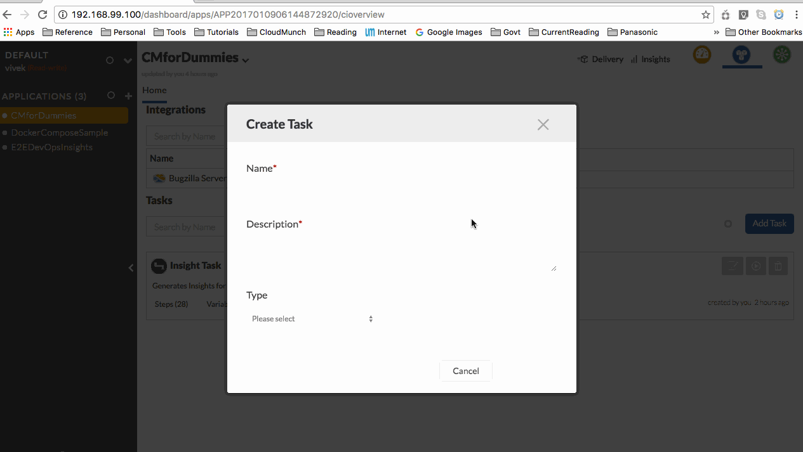

==========================================
Example: Insights with Hardcoded Interface
==========================================

Now that we have the `resource`, `integration` and `interface` setup, lets add the `plugin`

-  Download the contents of the folder
   `plugin_bugzilla_v1 <https://github.com/cloudmunch/cloudmunch-tutorial/tree/master/examples/plugin_bugzilla_v1>`__ to the folder "custom/plugins" inside the CloudMunch installation folder 

.. code-block:: bash
  
  $ cp -r ~/cloudmunch/cloudmunch-tutorial/examples/plugin_bugzilla_v1/bugzilla ~/cloudmunch/Install/custom/plugins

- :doc:`rebuild_services`

-  Once the services are up, you can verify if the resource has been added by invoking the API  ``api/plugins/bugzilla``

.. code-block:: bash
    
  $ curl http://192.168.99.100:8000/api/plugins/bugzilla?apikey=373ec269d3683736c82e4399b817cbbf24c08f20eebead1b6f856483ef43a0ba33dac304f4fb205daed4ab4815968515259c0d7108d52c705c88a8cd5a240a9b

  {"data":{"_created_by":"vivek@cloudmunch.com","documentation":{"description":"A simple plugin to get data from bugzilla"},"author":"Vivek Kodira","id":"bugzilla","name":"Tutorial Bugzilla Plugin v1","tags":[],"version":"1","status":"enabled","execute":{"options":"-debug","language":"PHP","main":"bugzilla/src/Bugzilla.class.php"},"inputs":{"url":{"type":"text","label":"URL","mandatory":true,"display":"yes","defaultValue":""},"assigned_to":{"type":"text","label":"Assigned To","mandatory":true,"display":"yes","defaultValue":""}},"outputs":{}},"request":{"request_id":"R2017010909181864840","response_time":"0.28 seconds","status":"SUCCESS"}}

`Our plugin is installed`

- Create a new task and add the plugin we've just installed to the task.



   Add a task and plugin

- Trigger the task and once it completes, check the insights for the resource. You should now see a card similar to the image below:

.. figure:: screenshots/plugin_bugzilla_v1/insights.png
   :alt: Insight card
   :align: center

   Insight card

The work is done by `Bugzilla.class.php <https://github.com/cloudmunch/cloudmunch-tutorial/tree/master/examples/plugin_bugzilla_v1/bugzilla/src/Bugzilla.class.php>`__ . 

Plugin Source Code
------------------

The ``process``` method is essentially performing the following steps:

- Get all resources of a particular type 
- For each resource
    - Fetch information from the it's integration
    - Transform and store information in the format expected by the :doc:`insights <insights>` cards

Review the contents of the file and particularly the ``process`` method. 

.. literalinclude:: ../examples/plugin_bugzilla_v1/bugzilla/src/Bugzilla.class.php
   :language: php
   :start-after: Only method you *need* to implement
   :end-before: End of process method
   :prepend: <?php
   :append: ?>

There are three helpers used in the code. 

- ``$this->getCloudmunchInsightHelper()`` - This helper is written specifically for insights and contains several utility methods to fetch resources and write cards and keymetric data
- ``$this->getCloudmunchService();`` - This helper is used to make calls to CloudMunch's API
- ``$this->getLogHandler()`` - This helper is used to log ``INFO`` and ``ERRROR`` messages

For more information on these and the other utilities available, please refer to the :ref:`refSDKs`


Did you notice that the fields ``bugzilla_url`` and ``assigned_to`` were necessary for the action ``get_bugs``. Here is the interface again. Do you see the two fields in squiggly brackets used in the method? 

.. literalinclude:: ../examples/interface_bugzilla_v1/bugzilla/definition.json
   :language: json
   :emphasize-lines: 11-12

CloudMunch replaces occurrences of anything in ``{}`` with the values available either in the `interface's` ``map`` node, the `integration`'s ``configuration`` node or with values passed to it in the request from the `plugin`. 

Summary
-------
In this lesson, we created a simple plugin which 

- Fetched all `resources` of type 'bugzilla' and for each `resource`
    
    - Fetched its `integration` details
    - Used the `integration` to fetch information from a third party system (via its `interface`)
    - It used the information to then create `insight` cards

In this example, we hardcoded the fields into the `interface` directly. If the values will never change, this approach is good enough. However, if you'd like the end-user to be able to configure these fields, you have more options

- :doc:`insights_integration_inputs_example`
- :doc:`insights_plugin_inputs_example`