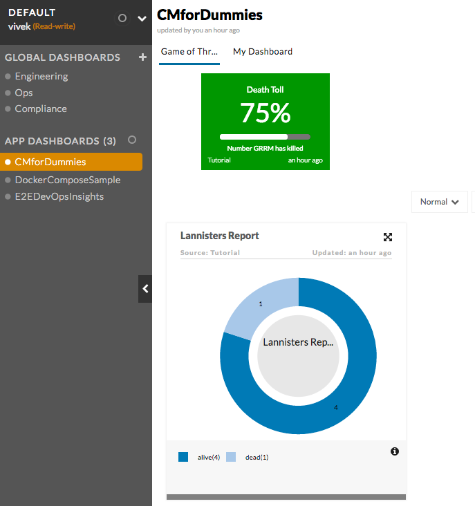

=====================================
Example: A Plugin with Hardcoded data
=====================================

Now that you are familiar with a plugin, lets create a simple insights plugin

-  :doc:`Create an empty application<first_application>` an application without any resources, integrations or tasks
-  Copy the application's ID (referred to here after as ``application_id``). We'll need it in the APIs we'll call.
-  Create a resource in your application by invoking the API ``/api/applications/<application_id>/resources``. *If you don't know what a resource is yet, don't worry. For now, just think of it as the categorization under which insights will be displayed*. The data we'll send to create a resource is below. Replace the application\_id with the correct value. The application\_name is a reference and can remain as-is.

.. code:: json

    {
      "type": "gameofthrones",
      "name": "Game of Thrones",
      "created_date": "2016-12-20 06:56:11.73265",
      "created_by": "__yourID__",
      "updated_by": "__yourID__",
      "updated_date": "2016-12-20 06:56:11.73265",
      "application_id": "__application_id__",
      "application_name": "{$applications->name}"
    }

-  Example invocation and response ( *If copy-pasting, remember to replace your application ID* )

.. code-block:: bash
    :emphasize-lines: 7

    $ curl --data 'data={"type":"gameofthrones","name":"Game of Thrones", "created_date":"2016-12-20 06:56:11.73265","created_by":"vivek@cloudmunch.com", "updated_by": "vivek@cloudmunch.com","updated_date":"2016-12-20 06:56:11.73265", "application_id":"APP2016122308383772923","application_name":"{$applications->name}"}' http://192.168.99.100:8000/api/applications/APP2016122308383772923/ resources?apikey=ceb01fa31b53c14cd04b542c50459cceb62eb43ab883190a33a39a5111ba24ded5c39426b362039ac72abaf31f3c5eac246a538e76d36b328be066248a066361
    
    {"data":{"type":"gameofthrones","name":"Game of Thrones", "created_date":"2016-12-23 08:58:40.23489",
    "created_by":"vivek@cloudmunch.com", "updated_by":"vivek@cloudmunch.com","updated_date":"2016-12-23 08:58:40.23489", "application_id":"APP2016122308383772923","application_name":"CMforDummies", "id":"RES2016122308584024026"},
    "request":{"request_id":"R2016122308583994943", "response_time":"0.39 seconds","status":"SUCCESS"}}

-  Notice the ``"id":"RES2016122308584024026"`` in the response? This is the ID allocated to your resource. We'll use it in the stubbed plugin 

-  Open the file `GameOfThrones.class.php <https://github.com/cloudmunch/cloudmunch-tutorial/tree/master/examples/plugin_simple_insights_example/gameofthrones/src/GameOfThrones.class.php>`__ 

  -  edit the line ``$resourceID = "";``\ and replace the actual resource ID as the value.

-  Download the contents of the folder `plugin_simple_insights_example <https://github.com/cloudmunch/cloudmunch-tutorial/tree/master/examples/plugin_simple_insights_example>`__ to the folder "custom/plugins" inside the CloudMunch installation folder.

.. code-block:: bash

  $ cp -r ~/cloudmunch/cloudmunch-tutorial/examples/plugin_simple_insights_example/gameofthrones ./custom/plugins

-  :doc:`rebuild_services`

-  Once the services are up, you can verify if the plugin has been added by invoking the API ``api/plugins/gameofthrones``.

.. code-block:: bash
    
  $ curl http:/192.168.99.100:8000/api/plugins/gameofthrones?apikey=79eaf7ee17664bb5ba4ca4ed2a27dd0c9c3efe410182c7caa8031642efbcadc46d1d6d0214930dba5e9e814ce5bbbba4295bca96bac766c04e6410770de07219
  
  {"data":{"_created_by":"vivek@cloudmunch.com","documentation":{"description":
  "A simple insights plugin"},"author":"Vivek Kodira","id":"gameofthrones","name":
  "Game of Thrones Plugin","tags":[],"version":"1","status":"enabled","execute":
  {"options":"-debug","language":"PHP","main":"gameofthrones/src/GameOfThrones.class.php"},
  "inputs":{"phrase":{"type":"dummy_input_not_used", "label":"Ignore","mandatory":false,
  "display":"yes","defaultValue":"Dummy input. Not used"}},"outputs":{}},"request":
  {"request_id":"R2017010607092683581","response_time":"0.55 seconds","status":"SUCCESS"}}

-  Add a new task. Add the plugin, execute the task and once it completes, check the dashboard. You should see the following cards and key metrics:

  
    Insights

Our (rather sombre) Insights are ready. Go over to :doc:`Insights <insights>` if you want to read up more about Insights. Come back and continue when ready.

Plugin Source Code Walkthrough
------------------------------

The work is done by `GameOfThrones.class.php <https://github.com/cloudmunch/cloudmunch-tutorial/tree/master/examples/plugin_simple_insights_example/gameofthrones/src/GameOfThrones.class.php>`__ . Review the contents of the file and particularly the ``process`` method. This is where we actually create the cards.

.. literalinclude:: ../examples/plugin_simple_insights_example/gameofthrones/src/GameOfThrones.class.php
   :language: php

For more information on the utilities used, please refer to the `SDK documentation <https://github.com/cloudmunch/CloudMunch-php-SDK-V2>`__

Summary
~~~~~~~

In this lesson, we first set the stage by creating an `application` and a `resource` and then we executed a `task` (which inturn invoked a `plugin`). The `plugin` contained logic to create some `insight` cards (using some hardcoded data) for the `resource` we'd just added.

Done! You now know what the output will look like. However, this was all in the backend. What we actually need is for the end-user to pick our resource from a list and configure the plugin to fetch relevant data. In the next chapter, we will create an actual resource that the end-user can see and configure.

Troubleshooting
~~~~~~~~~~~~~~~

"Found no reports for this resource"
^^^^^^^^^^^^^^^^^^^^^^^^^^^^^^^^^^^^

If you see this message or don't see any cards, you've most likely forgotten to update or updated the wrong ID of the resource ID in the plugin. Update and redo the process of adding the plugin to CloudMunch.

.. todo::
  Change this example to avoid the user having to create a resource. Instead, do it implicitly from within the plugin