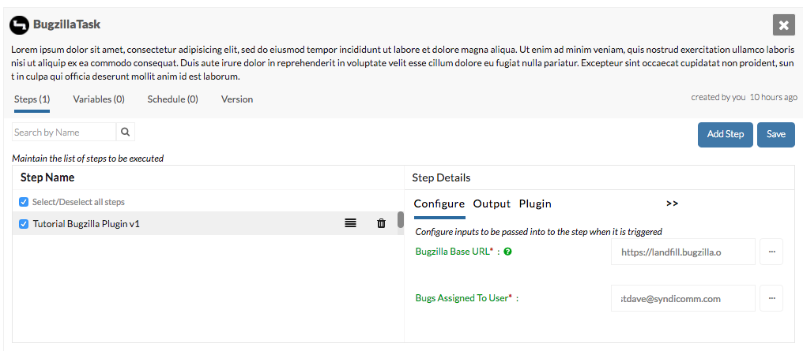

=======
Plugins
=======

Plugins are CloudMunch's workhorses: how stuff gets done. Adding a plugin typically involves adding

- A definition
- Source code & installer

Sample Plugin Definition File
-----------------------------
This definition contains meta-data about the plugin you are adding and is used by CloudMunch to display the configuration screen for a plugin. It is independent of the language your plugin will eventually be in.

.. literalinclude:: ../examples/plugin_bugzilla_v2/bugzilla/plugin.json
   :language: json

The nodes: ``_created_by``, ``name``, ``description``, ``author``, ``id``, ``version`` and ``tags`` are self-explanatory, so lets discuss ``status``, ``execute``, ``inputs`` & ``outputs``.

status
~~~~~~
The value in this node tells us whether to pick up your plugin or not. Plugins with any status other than ``enabled`` are ignored and will not be available for use within the system.

execute
~~~~~~~

.. literalinclude:: ../examples/plugin_bugzilla_v2/bugzilla/plugin.json
   :start-after: "status"
   :end-before: "inputs"

The contents of this node tell us which language the plugin is written in and where to find the plugin's executable. The languages we support today are ``PHP``, ``Java`` and ``Ruby``

inputs
~~~~~~
The contents of this node tell us what fields a user should see when configuring this plugin. It follows the :doc:`Configuration Driven UI<configuration_driven_ui>` pattern

.. literalinclude:: ../examples/plugin_bugzilla_v2/bugzilla/plugin.json
   :start-after: "main": "hello_world/src/HelloWorld.class.php"
   :end-before: "outputs"

    Plugin screen

outputs
~~~~~~~

The contents of this node tell us what variables are output by the plugin & available to the task after the plugin has completed execution. The values of these variables can be used to influence subsequent steps.

Plugins Src/Installation Files
------------------------------
For plugins written in PHP, we'd have the following files

-  src/<Name>.class.php: Actual logic necessary to perform the plugin's task.
-  composer.json: Composer file. Used to install the plugin and any of its dependencies
-  install.sh: Installs your plugin. You will typically never need to modify this file and can copy it from any other existing plugin

These other files will be necessary based on the language your plugin will be written in. We are using PHP in the tutorial's examples but :ref:`SDKs<refSDKs>` are also available in Ruby and Java. Do read the respective ReadMe.md files for detailed information on the syntax.

Plugin Logos
-------------
You can also add your own logo to a plugin. Just name the file: ``logo.png`` and put it under ``images`` (parallel to ``src``). When CloudMunch is rebuilt, the image will be copied as the logo of the plugin.

.. note::

  You can explore and inspect all plugin definitions with the API `/api/plugins/<plugin id>`. If you don't pass the ID, you'll get back definitions for *all* the plugins in the system