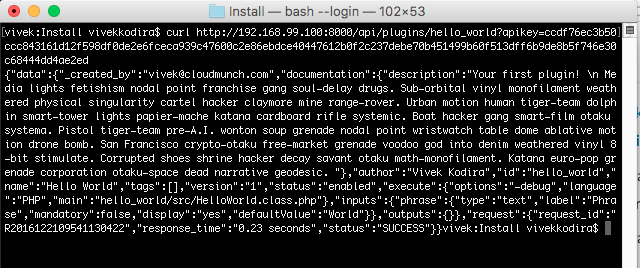
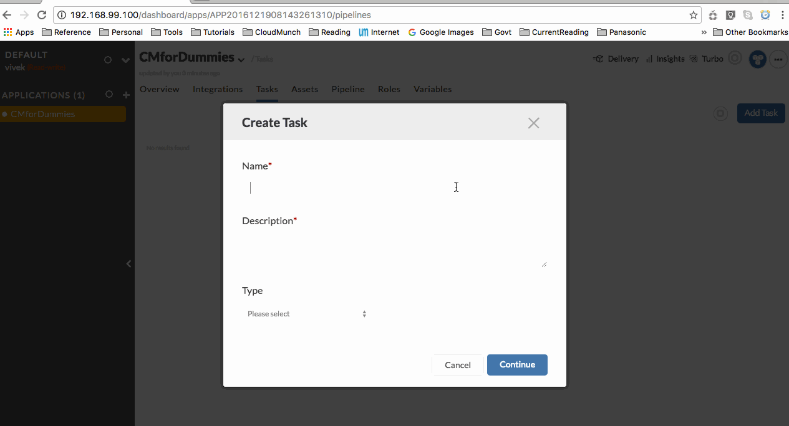
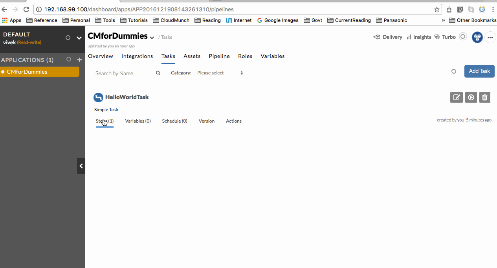
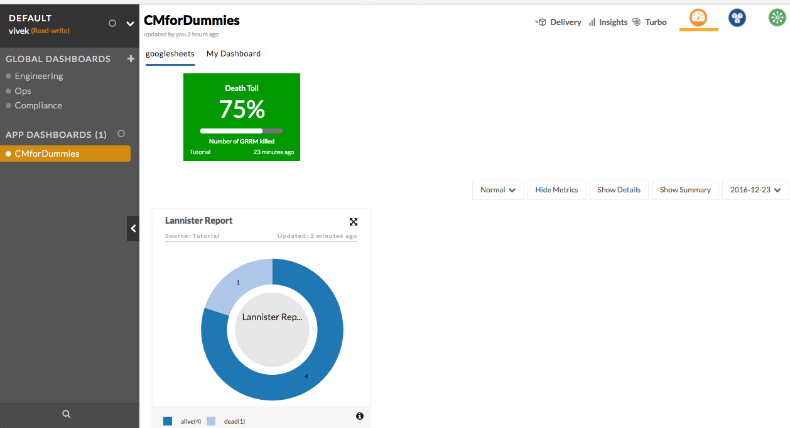
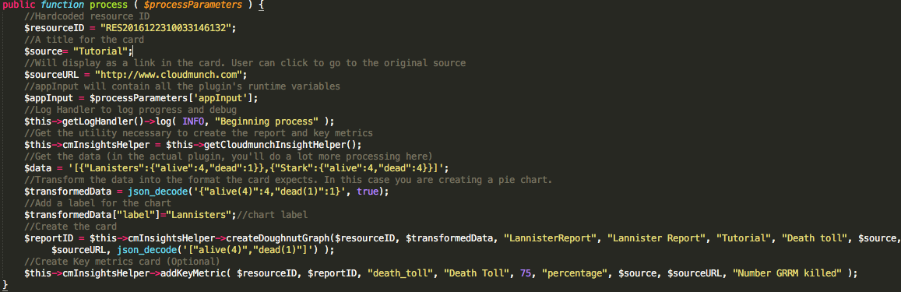
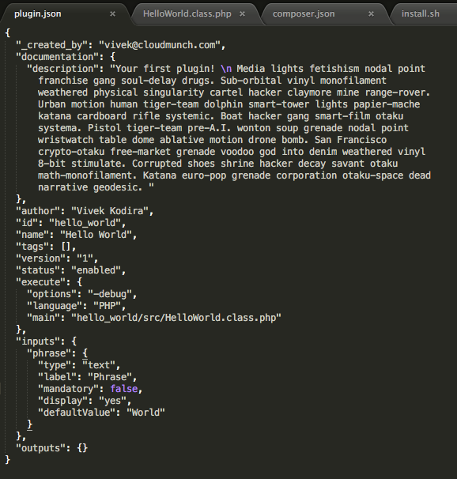
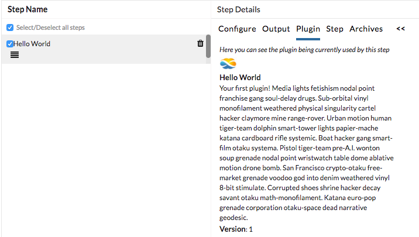

Plugins
=======

Plugins are are CloudMunch's workhorses: how stuff get done. Lets start with the simplest plugin possible: one that simply logs "Hello world"into the log and exits.

Hello World Plugin v1
---------------------

-  Download the contents of the folder `hello-world-plugin-v1 <https://github.com/cloudmunch/cloudmunch-tutorial/tree/master/examples/plugin_hello_world_v1>`__ to the folder "custom/plugins" inside the CloudMunch installation folder.

-  Switch to the command prompt, navigate to the CloudMunch installation folder and :doc:`rebuild_services`

-  Once the services are up, you can verify if the plugin has been added by invoking the API ``api/plugins/hello_world``.

   curl verification

-  Once CloudMunch is up, create a new task and try to add this plugin to the task.

   Add the plugin

Troubleshooting 
~~~~~~~~~~~~~~~

If you don't see the plugin in the list, it may be because the JSON is not well formed or because of caching. Verify the JSON and clear cache `http://<your\_host>:8000/api/reset`

-  Modify the step, add the phrase you want to see, run the task and check the logs. You should see the phrase you entered in the logs.

   Modify and run the task

*(Run the task with different inputs to verify that the phrase you enter is what is displayed in the logs)*

Plugin files
-------------

Lets understand the files necessary for a plugin. Open up the
`hello-world-plugin-v1 <https://github.com/cloudmunch/cloudmunch-tutorial/tree/master/examples/plugin_hello_world_v1/hello_world>`__
folder. Here you will find several files. Lets delve into a bit more
detail of the file: plugin.json

Plugin Definition File (plugin.json)
------------------------------------

+----------------------------+----------------------------+
| Definition                 | UI                         |
+============================+============================+
| |plugin definition file|   | |How it looks in the UI|   |
+----------------------------+----------------------------+

This file contains meta-data about the plugin you are adding and is used by us to display the plugin and when configuring it's inputs. It is independent of the language your plugin will eventually be in.

The nodes: ``_created_by``, ``name``, ``description``, ``author``, ``id``, ``version`` and ``tags`` nodes are pretty self-explanatory aren't they? So lets discuss ``status``, ``execute``, ``inputs`` & ``outputs``.

-  ``status``: The value in this node tells us whether to pick up your plugin or not. Plugins with any status other than ``enabled`` are ignored and will not be available for use within the system.
-  ``execute``: The contents of this node tell us which language the plugin is written in and where to find the plugin's executable. The languages we support today are ``PHP``, ``Java`` and ``Ruby``
-  ``inputs``: The contents of this node tell us what fields a user should see and enter data for when configuring this plugin within a task. In the example, you'll notice that the input is a non-mandatory 'text' field whose label is "Phrase". Change values of the nodes ``mandatory (true/false)``, ``display (yes/no)`` and ``label`` to see how the display and plugin behavior is changed. As you've probably already discovered, this node also follows the :doc:`configuration_driven_ui` pattern you are already familiar with.
-  ``outputs``: The contents of this node tell us what variables are put into the task after the plugin has completed execution. The values of these variables can then be used to influence subsequent steps. 

Lets look at the other files necessary to add a plugin. In our example we have

-  src/<Name>.class.php: Actual logic necessary to perform the plugin's task.
-  composer.json: Composer file. Used to install the plugin and any of its dependencies
-  install.sh: Installs your plugin. You will typically never need to modify this file and can copy it from any other existing plugin

These other files are necessary based on the language your plugin will be written in. We are using `PHP <https://github.com/cloudmunch/CloudMunch-php-SDK-V2/blob/master/README.md>`__ in this example but plugins can also be written in `Ruby <https://github.com/cloudmunch/cloudmunch-Ruby-SDK/blob/master/README.md>`__ and `Java <https://github.com/cloudmunch/CloudMunch-SDK-Java/blob/master/README.md>`__. Do read the respective ReadMe.md files for detailed information on the syntax.

Plugin Logos
-------------

Did you notice that the plugin logo in the Hello World example was the CloudMunch logo? You can also add your own logo to a plugin. Just name the file: ``logo.png`` and put it under ``images`` (parallel to ``src``). When CloudMunch is rebuilt, the image will be copied as the logo of the plugin.

Stubbed Plugin
--------------

Before we do everything necessary for an end-user to add resources and see insights, lets start with a stubbed plugin which skips all of the user interactions, fetches and just shows us the end result. 

-  `Create <#quick-application-creation>`__ an application without any resources, integrations or tasks
-  Copy the application's ID (referred to below as ``application_id``)
-  Create a resource in your application by invoking the API ``/api/applications/<application_id>/resources``. The data we'll send to create a resource is below. Replace the application\_id with the correct value. The application\_name is a reference and can remain as-is.

.. code:: json

    {
      "type": "googlesheets",
      "name": "googlesheets",
      "created_date": "2016-12-20 06:56:11.73265",
      "created_by": "vivek@cloudmunch.com",
      "updated_by": "vivek@cloudmunch.com",
      "updated_date": "2016-12-20 06:56:11.73265",
      "application_id": "APP2016122308383772923",
      "application_name": "{$applications->name}"
    }

-  Example invocation and response:

.. code:: bash

    $ curl --data 'data={"type":"googlesheets","name":"googlesheets","created_date":"2016-12-20 06:56:11.73265","created_by":"vivek@cloudmunch.com","updated_by":"vivek@cloudmunch.com","updated_date":"2016-12-20 06:56:11.73265","application_id":"APP2016122308383772923","application_name":"{$applications->name}"}' http://192.168.99.100:8000/api/applications/APP2016122308383772923/resources?apikey=ceb01fa31b53c14cd04b542c50459cceb62eb43ab883190a33a39a5111ba24ded5c39426b362039ac72abaf31f3c5eac246a538e76d36b328be066248a066361
    {"data":{"type":"googlesheets","name":"googlesheets","created_date":"2016-12-23 08:58:40.23489","created_by":"vivek@cloudmunch.com","updated_by":"vivek@cloudmunch.com","updated_date":"2016-12-23 08:58:40.23489","application_id":"APP2016122308383772923","application_name":"CMforDummies","id":"RES2016122308584024026"},"request":{"request_id":"R2016122308583994943","response_time":"0.39 seconds","status":"SUCCESS"}}

-  Notice the ``"id":"RES2016122308584024026"`` in the response? This is the ID allocated to your resource. We'll use it in the stubbed plugin 

-  Go to the file `GoogleSheet.class.php <https://github.com/cloudmunch/cloudmunch-tutorial/tree/master/examples/plugin_googlesheets_v1/googlesheets/src/GoogleSheet.class.php>`__ and edit the line ``$resourceID = "RES2016122308584024026";``\ and replace the actual resource ID as the value.
-  Download the contents of the folder `plugin\_googlesheets\_v1 <https://github.com/cloudmunch/cloudmunch-tutorial/tree/master/examples/plugin_googlesheets_v1>`__ to the folder "custom/plugins" inside the CloudMunch installation folder.

-  Switch to the command prompt, navigate to the CloudMunch installation folder and :doc:`rebuild_services`

-  Once the services are up, you can verify if the plugin has been added by invoking the API ``api/plugins/googlesheets``.

-  Add a new task. Add the plugin, execute the task and once it completes, check the dashboard. You should see the following cards and key metrics:

Card

-  Our (rather sombre) Insights are ready. The work is done by `GoogleSheet.class.php <https://github.com/cloudmunch/cloudmunch-tutorial/tree/master/examples/plugin_googlesheets_v1/googlesheets/src/GoogleSheet.class.php>`__
   in the ``process`` method. Rather than explain what is occurring, I've added inline comments you can read with the code. For more information on the utilities used, please refer to the `SDK documentation <https://github.com/cloudmunch/CloudMunch-php-SDK-V2>`__

Plugin code

Done! But that was a stubbed plugin and a mock Resource. So you know what the output will look like. Lets now create an actual resource that the end-user can see and configure.

.. _Rebuild Services: docs/rebuild_services.rst
