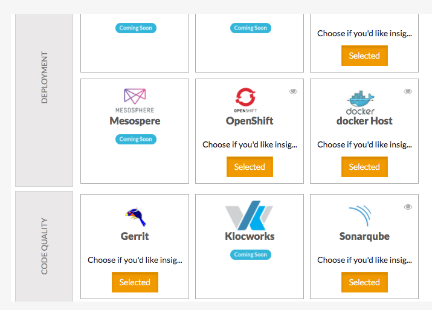
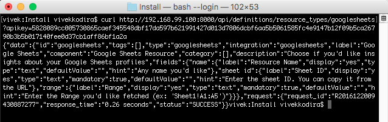

Resources
=========

A resource is essentially a source from which we fetch information. To add a resource into CloudMunch, we simply need to add its definition file.

Resource Definition
~~~~~~~~~~~~~~~~~~~

.. code:: json

    {
      "id": "googlesheets",
      "tags": [],
      "type": "googlesheets",
      "integration": "googlesheets",
      "label": "Google Sheets",
      "component": "Google Sheets Resource",
      "category": [ "Tutorial" ],
      "description": "Choose if you'd like insights about your Google Sheets profiles",
      "fields": {
        "name": {
          "label": "Resource Name",
          "display": "yes",
          "type": "text",
          "defaultValue": "",
          "hint": "Any name you'd like"
        },
        "sheet id": {
          "label": "Sheet ID",
          "display": "yes",
          "type": "text",
          "mandatory": true,
          "defaultValue": "",
          "hint": "Enter the sheet ID. You can copy it from the URL"
        },
        "range": {
          "label": "Range",
          "display": "yes",
          "type": "text",
          "mandatory": true,
          "defaultValue": "",
          "hint": "Enter the Range you'd like fetched (ex: 'Sheet1!A1:A5')"
        }
      }
    }

**NOTE** Ensure the folder name and the value of the nodes ``id`` and ``type`` in the file match

The JSON file above is the definition of the integration. The fields ``id``, ``label``, ``type`` (``id``\ =\ ``type``) and ``description`` are self-explanatory. Lets consider the others 

-  integration: This tells CloudMunch what integration this resource belongs to. We'll be adding the Integration itself in a bit

-  component: This node is similar to ``label``. When adding a resource, the end user may encounter some errors. Those errors will refer to this resource using the value in this node in their text.

-  category: This node tells CloudMunch what category the resource belongs into.

:alt: resource categorization

Remember this screen? It is displayed when choosing resources. Note they are organized by Categories (on the extr eme left) The category you enter will most ly be one of the existing ones from this screen. If you add a new one, the resource will stil l be disp layed, but in the new category you've ente red. Remember to add at least one, resources  without categories are not displayed in the UI.

-  fields: This node tells CloudMunch what fields to display when someone is adding this resource into their application. Here, since we are adding a Google Sheets resource, we need the user to enter a name for the resource, the Sheet ID and the Range. The node follows CloudMunch's `Configuration Driven UI <#configuration-driven-ui>`__ pattern.

Lets now add the resource to CloudMunch.

-  Download the contents of the folder `resource\_googlesheets\_v1 <examples/resource_googlesheets_v1>`__ to the folder "custom/resources" inside the CloudMunch installation folder.

-  Switch to the command prompt, navigate to the CloudMunch installation folder and `rebuild CloudMunch <#rebuild-services>`__

-  Once the services are up, you can verify if the resource has been added by invoking the API ``/definitions/resource_types/googlesheets``.

   curl verification

-  You should also now see the resource in the UI

.. figure:: screenshots/resource_googlesheets_v1/resource_verification.gif
   :alt: resource in ui

   resource in ui

A resource is only available within an integration. So before we can add this resource, we'll need an Integration. Lets add one next.

