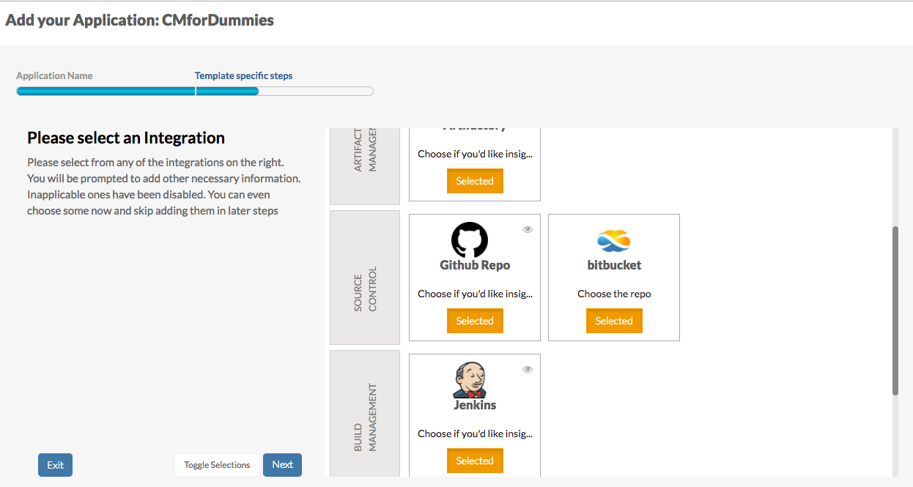

=========
Resources
=========

A `resource` is essentially a source within the `integration` from which we fetch information

    Resource selection screen

To add a new type of `resource` into CloudMunch, we simply add its definition

Sample Resource Definition
~~~~~~~~~~~~~~~~~~~~~~~~~~
.. literalinclude:: ../examples/resource_bugzilla_v1/bugzilla/definition.json
   :language: json

`a sample resource definition file`

The fields ``id``, ``label``, ``type`` (``id`` = ``type``) and ``description`` are self-explanatory. Lets consider the others

integration
^^^^^^^^^^^
The value of this node tells CloudMunch what type of ``integration`` this ``resource`` belongs to

component
^^^^^^^^^
This node is similar to ``label``. When the end user attempts to add an instance of this resource type, the system may encounter some errors; it will use the value of this node in error messages

category
^^^^^^^^
This node tells CloudMunch what category the resource type belongs into. It is displayed in the application creation wizard. Resources are organized by Categories (*see the vertical labels on the extreme left in the screen above?*). The category you enter will mostly be one of the existing ones from this screen. If you add a new one, the resource will still be displayed, but under the new category. 

.. warning:: 

    Remember to add at least one, resources without categories are **not** displayed in the UI.

fields
^^^^^^
This node tells CloudMunch what fields to display when someone is adding this resource into their application. In this example, users will be asked to enter a name for the resource. The node follows CloudMunch's :doc:`Configuration Driven UI<configuration_driven_ui>` pattern.

.. literalinclude:: ../examples/resource_bugzilla_v1/bugzilla/definition.json
   :start-after: "description"
   :end-before: "carouselText"

.. note::

  You can explore and inspect all resource definitions with the API `/api/definitions/resource_types/<resource id>`. If you don't pass the ID, you'll get back definitions for *all* the resource types in the system