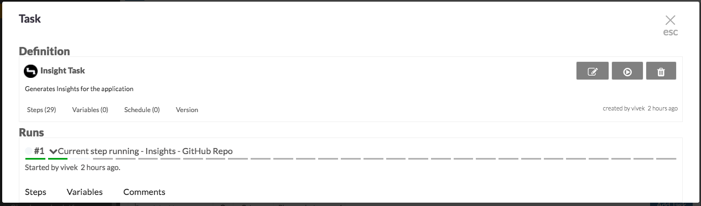
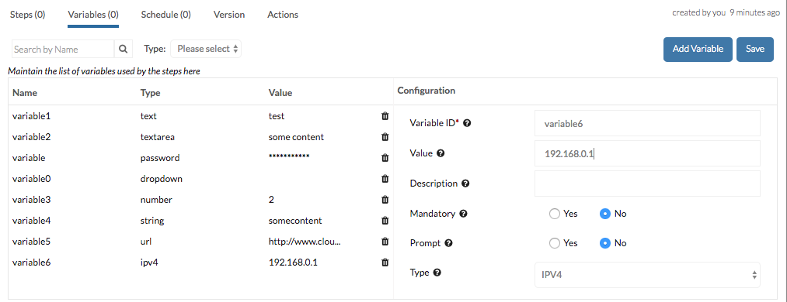

=====
Tasks
=====

A task is a sequence of related steps (each linked to a `plugin`) which you run to accomplish something. 

An `Insight task` is automatically created at the end of the application creation wizard and you can modify, delete it and even create others from inside the application

Tasks are stored as JSONs

A Sample Task JSON
==================
.. note::

	You will see (or may have seen) other JSONs used to represent entities in this tutorial but the JSON below is different in that the others represent **definitions** (types) of entities such as :doc:`integrations`. The one below is created by the application when you create a task and so represents **an instance** of a task. We will also discuss a task type definition later below.

.. literalinclude:: ../examples/insight_task/sample_pipeline.json
	:language: json

The nodes ``description``, ``name``, ``id``, ``application_id``, ``tags``, ``created_by``, ``updated_by``, ``updated_date`` and ``created_date`` are straightforward so lets look at the others

variables
---------
This object contains information about pipeline-level variables. We support several different data types and validations

schedule
--------
This array contains information about the schedules a task should run on. The schedule could either be a CRON job notation or an event on an Integration (such as a pull request on Github)

steps
-----
This object contains a key for every `step` in the task. The keys represent a unique ID for the step and the values the step's details. 

step
~~~~
Here is a sample step

.. literalinclude:: ../examples/insight_task/sample_pipeline.json
	:start-after: 07493318132694142
	:end-before: reports

For each step, we store the following information

- order
	This number signifies the position of the step in the sequence
- parameters
	These are the parameters passed which will be passed to the plugin when it is triggered
- name
	This is the name of the step - usually (but not necessarily) the same as the plugin name
- plugin_id
	This is an identifier of the plugin invoked by the step
- abort_on_failure
	This (yes/no) flag tells the task whether it should abort execution if the step fails
- display
	This (yes/no) flag tells the task whether this step should be displayed in the run details
- execute
	This (yes/no) flag tells the task whether this step should be executed
- output
	This object contains key-value pairs signifying the output expected from the step

.. note:: 

	There are several other fields in the JSON such as ``raise_defect_on_failure``, ``retry_on_failure`` which we've not discussed. These are present to allow for planned but as-yet unimplemented functionalities

.. _taskDef:

Task Definitions
================
When the application-creation wizard has all the information it needs, it fetches the task definitions available in the system and uses them to create application tasks. The definition of the insights task can be retrieved using the API ``/api/definitions/insight_pipelines/<product_id>`` (*where product ID is the ID of the product you've chosen in the first screen of the wizard*)

.. note::
	
	There are three products available within CloudMunch: `delivery`, `insights` and `jenkins`. Your installation may have one of these - using any of the others will just mean that the definition you get will contain steps that reference plugins not yet available to you (and so will fail). 

	If you didn't see a product selection screeen and so are not sure what your product is, just use the API ``/api/definitions/insight_pipelines/insights``.

.. code-block:: bash

	$ curl https://dev.cloudmunch.com:543/api/definitions/insight_pipelines/insights?apikey=506bc8e9f0e11271727c9810c505cb8c8255faa017f893ca366e33d4d82cbe9022fd86046ba3b39e6a4ef18c9a1b946fc049bc2e1bf598d8ab7d82f9772884a2

The formatted data returned in the response will look something like this:

.. literalinclude:: ../examples/insight_task/task_definition.json
	:language: json

There are three important nodes in this JSON, lets look at each.

run
---
The value of this node (yes/no) tells CloudMunch whether the task should be triggered from within the wizard after it is created

nodesToBeReplaced
-----------------

.. literalinclude:: ../examples/insight_task/task_definition.json
	:lines: 4-8

This node contains key-value pairs. The keys (ex: ``__REPLACE_APPLICATION_ID__``) correspond to placeholders within the task definition. The values (ex: "app.id" ) correspond to runtime variables available to the wizard during its execution. When the task is created, the placeholders are replaced with the runtime variable values

pipeline
--------
This node contains the actual blueprint of the task and one we are already familiar with. The only differences are the placeholders we just discussed and the absence of meta-data nodes like ``created_by``, ``updated_by``, ``updated_date`` and ``created_date``

